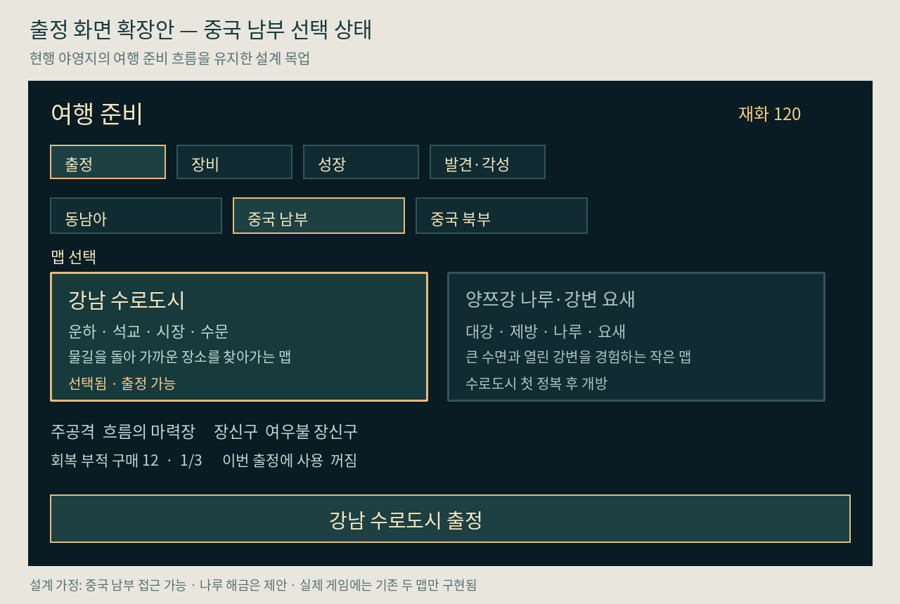
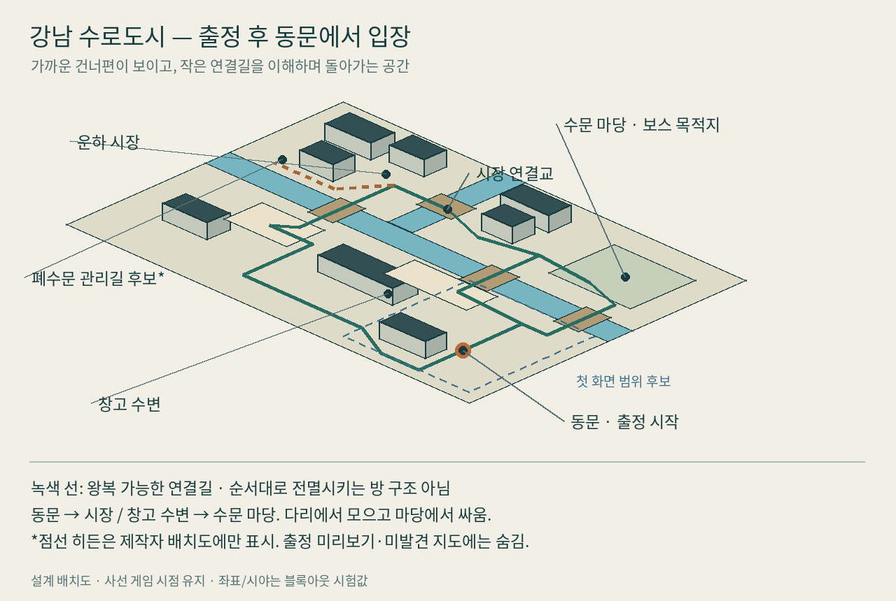
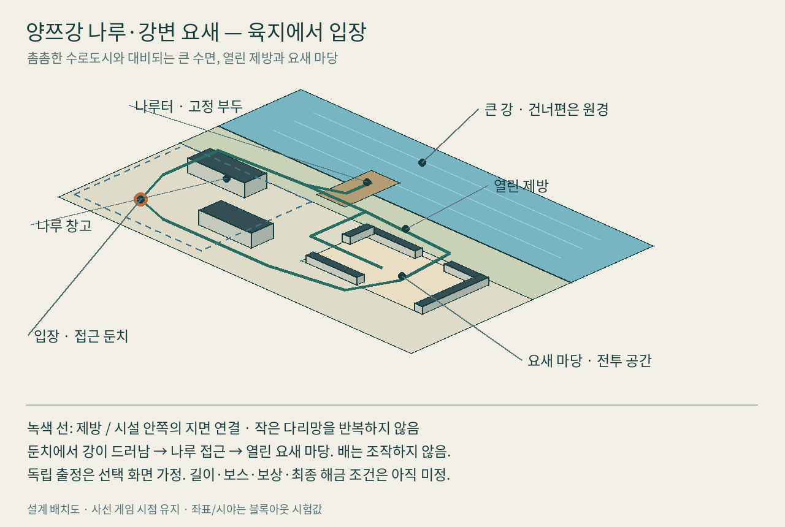
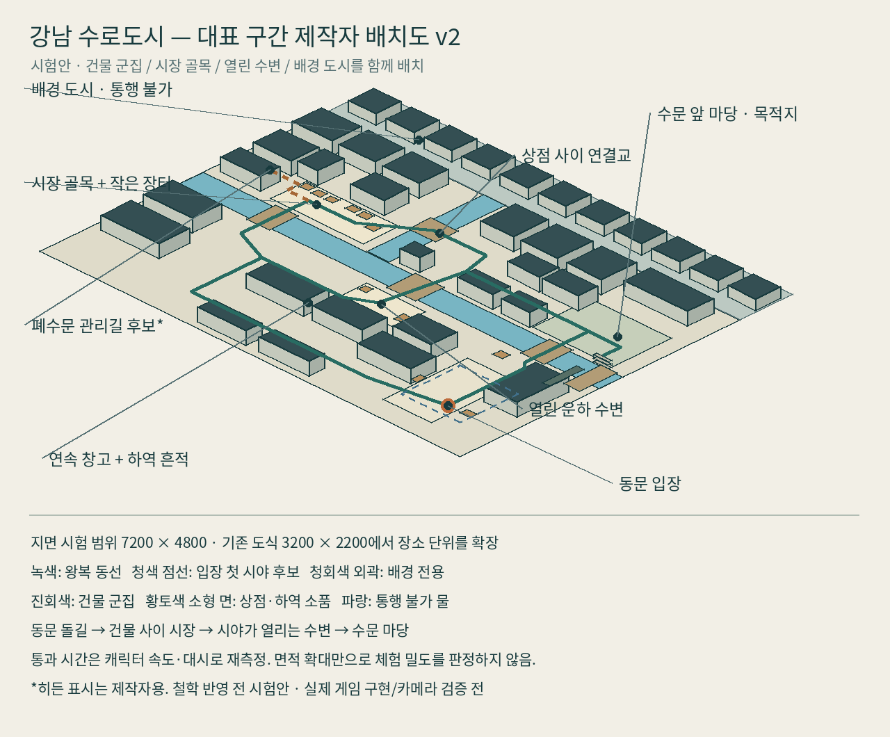

# 다음 제작 지시 — 첫 지역을 완성품 수준으로 묶기

## 현재 실행 순서 — 2026-10-03 v46 제출 이후

현재 배포 고정점 및 `codex/current-playtest`는 `d1eb0f1`이다. 세 맵 해금·공통 성장·습지 고유 보스·정산은 v45에 연결됐다. DEV_STATUS의 정확한 전달/검증 범위를 우선한다. 아래 v26 초안은 역사 기록이며 240초, 영구 성장10종·5등급, 동남아 세 맵이라는 최신 결정을 덮어쓰지 않는다.

### 바로 이어갈 검증 묶음

v46은 습지 대표 식생/석재, 장소별 편성, 동행 지정사격, 동행음 수정까지 제출했다. 같은 후보의 낮은 우선순위 장식만 반복 수정하지 않는다. 다음은 (1) 세 맵의 반복 출정/정산/구매/종료·재실행 및 일시정지 전환 안정성, (2) 동일 첫 권역 후보의 Windows export와 native runner 실행 경로다. 자동 입력기의 히든 정원 미지원 때문에 발생할 수 있는 정체와 실제 게임 진행 막힘을 분리한다. 그 뒤 사람 피드백과 합쳐 장소·빌드·경제의 큰 병목을 재정렬한다.

### 1. 권역 → 맵 → 소구역 → 실제 화면

- 동남아 권역의 공통 재료는 오래된 석재·열대 식생·직접 전투다. 맵별 목적은 사원의 열린 높은 뜰과 참배 축, 정글의 능선/강변 고저와 순환, 습지의 낮고 축축한 수변/거대한 얼굴유적/안쪽 성소로 구별한다.
- 현재 대표 아트 묶음은 습지 수관·판근·얼굴유적·성소 실루엣이다. 기존 지형과 배우가 읽히는 같은 화면에서 검증한다. 통과한 구조를 사원/정글의 지역 맥락에 맞춰 확장하고, 작은 장식 수정만 무한 반복하지 않는다.
- 하이브리드 positional 동행음의 청취점 결함을 먼저 고친다. 소리 출력 계약과 사람의 음색/음량 평가는 구별한다.

### 2. 처음 세 번의 출정과 세 빌드

- 신규 사원 출발에서 패배/정산/구매/장착/재출정의 실제 입력 흐름을 점검한다. 습지 성장을 위해 주입한 prior-clear fixture는 이 증거가 아니다.
- 집결·폭발, 이동 연계, 동행 화력은 피해 합계 외에 실제 공격 순서·이동 빈도·반격 선택이 달라지는지 본다. 무효 등급/조건 불일치를 먼저 제거하고 실제 선택 기회와 비용을 같이 기록한다.
- v45 정상속도 습지 grown 한 판은 26선택과 합성 선택정지40.78초였다. 후반 XP 시험은 21선택/32.96초로 줄었지만 보스 결과가 달라 기본에는 미적용이다. 한 봇/seed로 난도나 재미를 확정하지 않는다.

### 3. 다음 제출과 첫 권역 완료 판정

다음 제출은 대표 장소 아트·전투 소리·성장 흐름 개선이 같은 실행 파일에서 연결되고 전체 회귀 및 native 패키지 검증을 마친 묶음이다. 낮은 우선순위 문구만으로 v45를 다시 배포하지 않는다.

첫 권역 완료에는 세 맵 자연 완주, 구별되는 장소/보스/대표 빌드, 보상으로 다음 판 행동이 바뀌는 경험, 일반 저장 재시작, 렌더 가림/장시간 성능 및 사람의 재미·미감 확인이 남아 있다. 자동 통과만으로 완료 처리하지 않는다. 사용자 플레이를 기다리는 동안 독립 제작과 검증은 이어간다.

작성: 2026-10-01 KST. 조사 기준: `codex/v25-readability-density` / `3e0557819e08cb8b3deca0ebb3a2645b944b595a`.
이 문서는 사용자의 원인 분석·대안·Codex 실행 지시 요청에 대한 작업 계획이다. 설계 정본은 `LOOP_CONQUEST_MASTER.md`, 현재 실행 범위는 `DEV_STATUS.md`다. 여기의 목표 수치는 측정 결과가 아니다. 이는 v26 초안의 조사 기준이며, 뒤의 실행 결과와 `DEV_STATUS.md`가 실제 최신 구현을 설명한다.

초기 실행 순서(v38 기록): 양쪽 보스 겹침의 플레이어 표시를 검증한 뒤, 기존 돌조각/뿔 돌진적 실루엣을 실제 하이브리드 교전에 통합한다. 현재 전달 범위와 다음 작업은 끝의 §23과 `DEV_STATUS.md`를 따른다.

## 1. 현재 단계와 결론

현재는 **3단계 앞부분: 대표 콘텐츠 프로토타입 → 첫 지역 통합 완성 샘플(vertical slice)**이다. 2단계의 경제·대표 빌드 체감 수용은 남아 있다. 그 미검증을 모든 후속 작업을 막는 별도 대형 단계로 확대하지 말고 같은 대표 샘플 안에서 닫는다.

이미 있는 것: 야영지, 사원/정글 두 맵, 직접 공격/대시/Q, 자동 동행 공격, 레벨업 카드 16종, 장비/교체 옵션/영구 성장 8축/공격 상위 분기, 화폐·소모품·재배분, 히든 두 장소·각성, 목적지 보스·반격·1회 재도전, 저장 v6, 결과/일시정지/장비/발견 UI.

다음 성과물은 새 기능 목록이 아니라 **야영지 → 사원 한 판 → 보상 이해 → 실제 구매·장착 → 다른 행동으로 재출정**이 자연스럽게 이어지는 하나의 플레이 빌드다. 정글은 회귀 유지한다. 기존 정글을 폐기하거나 사원 전체를 재설계하는 지시가 아니다.

완성 뒤에는 같은 제작 규격으로 정글을 완성하고, 제작량을 확인해 중국 남부 후속 맵을 결정한다. 마지막 4단계는 전체 완주·설정·성능·저장·배포 품질이다.

## 2. 확인한 사실과 루즈함의 가설

| 관찰 | 코드·기록 근거 | 판단과 다음 확인 |
|---|---|---|
| main과 실제 작업이 다름 | main `2f2c680`, v25까지 31커밋 차이 | 새 세션이 main만 읽으면 기능을 중복 제안하거나 과거 규칙을 적용한다. 최신 브랜치를 매번 확인하고 수용된 묶음을 main에 통합해야 한다. 이번 조사에서 main은 이동하지 않았다. |
| 피드백에 따른 국소 개선이 연속됨 | v18 변주 → v19 히든 → v20/21 보스 → v22/23 계곡·UI → v24 경로 → v25 밀도 | 진전은 실제로 있다. 다만 동일한 대표 플레이의 전후 비교·완료 판정이 약해 다음 결함이 곧 다음 목표가 된다. 원인 가설이며 모든 수정이 낭비라는 뜻은 아니다. |
| 전투 압박·성장·회복·중단·경제가 연결됨 | `hybrid_region.gd::_spawn_rate`, `_on_enemy_defeated`; `run_growth.gd::gain_xp` | v25 스폰율 ×1.5/상한72. 처치가 증가하면 XP·레벨업 20% 회복·카드 정지·화폐도 증가할 수 있다. 실처치량은 상한/동선/화력 때문에 선형 증가하지 않는다. 밀도만 높여 긴장이 개선됐다고 판단하지 않는다. |
| 시간 변주는 이미 구현됨 | `_encounter_phase`: 60/130/210초 압박과 뒤의 회복 구간 | “중간 변주를 추가”를 재지시하지 않는다. 실제로 타깃/이동/공격 선택이 달라지는지 본다. 스폰이 줄어도 누적 생존 적 때문에 숨 고르기가 없을 수 있다. |
| 장소와 보상이 존재하지만 연결의 질은 미수용 | 사원 정원, 계곡, 두 접근 경로, 각성 UI와 v25 사용자 확인 항목 | “탐험 목표가 전혀 없다”는 진단은 틀리다. 목적지 인지, 접근 중 기대, 도착 화면, 보상 적용의 네 부분을 한 구간에서 검토한다. 면적·수집 목표 증가는 처방이 아니다. |
| 가격곡선 검증이 남음 | `run_profile.gd`: 성장20/35, 장비24/35/45, 공격분기60 | 작은 성장과 큰 저축을 의도했지만 실제 수입 대비 가격은 미수용. 총액을 올리기 전에 성공/실패/귀환과 1~3회차 구매 기회를 비교한다. |
| 강화 전후 설명은 이미 있음 | `run_growth.gd::describe_card`, `hub.gd` 장비/성장 UI | 전후 수치 표시를 신규 기능처럼 만들지 않는다. 같은 크기의 문장·조건/적용대상 이해·실제 계산 일치가 남은 검토다. |
| 자동 검사는 체감 증거가 아님 | v25 전체48개/CI 통과 기록; 실제 재미·Windows 미검증 명시 | 충돌·저장·정지 검증과 사람의 몰입·미감·재도전 의향을 분리한다. 이번 조사는 엔진 실행이나 플레이를 하지 않았다. |

핵심 가설: **기능 부족보다는 기존 선택이 행동·장소·보상으로 전달되는 밀도가 낮고, 개발에서도 '완성할 한 덩어리'가 약하다.** 완성 샘플로 검증하되, 사용자의 실제 지루함 원인을 코드만으로 확정하지 않는다.

## 3. 유지할 계약

- 현행 사선/2.5D 유지. 평면 탑뷰 전환, 전체3D 전환, 자유점프·복층 내비게이션 도입 금지.
- 5분 보스 출현, 목적지 접근 교전, 자유 출입·HP 유지·런당 재도전1회 유지.
- 매 레벨업 즉시 카드 선택·HP20% 회복 유지. 묶음 선택으로 되돌리지 않는다.
- 히든은 선택, 미발견 입구/전체 개수 숨김, 영구 보상 즉시 저장, 기존 두 히든 보존.
- 카드/옵션/장비를 새로 늘리기 전에 기존 3개 빌드(집결·폭발 / 이동 연계 / 동행 화력)를 완성 샘플에서 비교.
- 런 중간 저장·일반 대화·호감도·새 기동 분기·새 지역은 이 묶음에 넣지 않는다.
- 장기 규칙을 바꿔야 할 구체적 증거가 생겼을 때만 변경안과 차이를 제시한다. 이미 합의한 설문을 반복하지 않는다.

## 4. Codex 실행 순서

한 번에 전부 재작성하지 않는다. 아래 A→B→C→D 순서로 각 묶음이 독립적으로 실행되는 커밋을 만든다. 필요한 조사·구현·관련 검증은 매번 '계속할까요'를 묻지 않고 수행한다. 사람의 감각 판단을 테스트 결과로 대신하지 않는다.

### A. v25 기준선과 첫 패치 — 지금 착수

목표: 밀도 증가 뒤 성장 속도/회복/중단/수입이 서로 맞는지 확인하고, 카드·결과·야영지의 기존 정보를 읽기 쉽게 연결한다.

1. 시작 시 원격 전체 브랜치/최근 커밋 확인. 이 조사 기준보다 새 코드가 있으면 보존하며 계획과 차이를 먼저 확인한다. 깨끗한 짧은 작업 브랜치 사용. main만 pull하고 덮지 않는다.
2. Godot4.6으로 기존 빌드를 실행. 프로필은 격리한다. 실제 사용자 저장을 초기화하거나 테스트용 돈으로 오염시키지 않는다.
3. 기존 지표 `run_time`, `kills`, `run_currency`, `level`, `choice_windows_opened`, `points_earned/spent`, 카드·장비와 결과 화면을 활용한다. 부족한 값만 로컬 디버그 로그로 추가: 실제 선택창 체류시간, 피격/실제 회복량(초과회복 제외), 보스 도착·교전·처치 시간. 새 대시보드/원격 수집/런 기록 복사 버튼은 만들지 않는다. 디버그 기록은 출시 UI에 노출하지 않는다.
4. 정상속도 한 판에서 화면 녹화/이벤트 시각으로 '적과 싸우지 않고 걷기', '싸우지만 같은 행동만 반복', '카드 읽기 정지', '보스 대기'를 구분한다. 무적·가속 자동 런은 상태 연결 확인에만 쓴다. 실제 조작 수단이 없으면 이를 명시하고 가능한 코드/렌더/산술 검증을 끝낸다.
5. 기존 카드 화면을 다듬는다: 카드명/적용대상 → 핵심 변화 → 정확한 전후값·등급의 시각적 우선순위. 현재 장비와 관련된 사실은 보여도 근거 없는 '최고/추천' 점수는 만들지 않는다. 1/2/3·클릭·리롤·정지 의미는 유지. 긴 연계 카드, 마지막 등급, 후보2/1/0개를 포함해 960×540와1280×720에서 잘림/겹침 확인. 수치는 하드코딩을 더 붙이지 말고 기존 실제 계산과 대조한다.
6. 결과/야영지 연결: 기존 획득 장비·옵션·각성이 무엇에 적용되고 어디서 장착하는지 확인. 정산 실패는 성공 보상처럼 표시하지 않는다. 미발견 히든은 결과 안내에도 노출하지 않는다. 영구/이번 런 정보를 같은 덩어리로 섞지 않는다.
7. 밀도/시간대 편성/XP 요구량/가격 중 **한 비교에서 한 계열만** 튜닝한다. 전역 적 수·XP·가격·보스HP 동시 변경 금지. 현행 레벨업 회복/카드 정책 자체는 바꾸지 않는다. 실제 결과 없이 임의 가격표를 최종 확정하지 않는다.

파일 중심: `game/run_growth.gd`, `game/hybrid_region.gd`, `game/hub.gd`, `game/run_profile.gd`, `game/enemy_definitions.gd`.
관련 회귀: `verify_growth_rewards`, `verify_card_diversity`, `verify_growth_expansion`, `verify_hub_layout`, `verify_run_profile`, `verify_v25_feedback` 중 변경된 경로. UI 저위험 문구 수정마다 새 테스트 파일을 만들지 않는다. 돈/정지/선택 동작 변경에는 해당 경계 검증을 한다.

완료 산출: 실행 빌드1개, 카드/결과/장비 화면 캡처, 한 판 기록(플레이인지 자동 검증인지 명시), 변경 전후와 남은 가설 각3줄. 신규 기능 수를 성과로 쓰지 않는다.

### B. 사원 대표 구간의 시각·소리·공간 통합

목표: 회랑→성소 접근→보스 교전과 기존 정원 분기가 하나의 장소로 느껴지는 구간을 만든다. 사원 전체 확대나 정글 재작업을 병행하지 않는다.

- 기존 경로와 카메라를 유지하고 목적지 실루엣·가려졌다 열리는 시야·밝기/색 대비·물과 식생 단서로 접근을 읽히게 한다. 미발견 정원 입구를 화살표/물음표로 공개하지 않는다.
- 대표 바닥/벽/식생/랜드마크 소수, 주인공1·일반적1·보스1의 읽히는 표현, 피격/평타 마무리/보스 예고/반격/보상 소리를 같은 인게임 화면에서 묶는다. 전 맵 에셋 양산은 아직 하지 않는다.
- 밝고 선명한 셀채색·친근한 실루엣. 최종 종족/복식 등 미정 사항을 조용히 확정하지 않는다. 기존 임시 캐릭터로도 통합 검증은 진행 가능하다.
- 이미지 생성 참고 그림만으로 게임 아트 완료를 보고하지 않는다. 실제 카메라 크기·발 위치·가림·애니메이션·충돌·공격 표시를 함께 확인한다.
- 히든이 없는 본선 진행, 히든 왕복 후 보스, 같은 빌드 재도전의 세 경로가 막히지 않아야 한다.

완료 산출: 실제 같은 구간의 전후 영상/화면, 게임에서 적용된 소수 에셋과 크기 규격. 사용자는 최종 샘플에서 장소감과 전투 가독성만 판단한다. 자동화 가능한 엔진 검증을 대신 맡기지 않는다.

### C. 기존 세 빌드와 1~3회차 성장 연결

| 빌드 | 기존 재료 | 확인할 행동 차이 |
|---|---|---|
| 집결·폭발 | W_ECHO,3·4타, FINISH, 관련 옵션·각성 | 적을 모을 위치와 4타 타이밍을 고르는가 |
| 이동 연계 | W_FLOW,Q, U_SLASH 계열, WEAVE | 진입→강화 평타→Q 환급·재배치가 쓰이는가 |
| 동행 화력 | A_EMBER, 여우불 카드/옵션, COMPANION | 거리·동행 연계·공격 위치가 달라지는가 |

첫 출정부터 히든/미해금 장비를 가진 것으로 가정하지 않는다. 처음 시작 검증과 중간 성장 빌드 비교를 분리한다. 동일 맵·동일 영구 투자 총액·비슷한 카드 기회로 비교하고 승률만 보지 않는다.

작은 구매/큰 저축이 실제 존재하는지 1~3회차 예상표와 관찰을 대조한다. 신규 장비의 해금→구매→장착→실제 효과가 이어져야 한다. 정원/계곡 각성을 모두 얻는 것이 보스 필수조건이 되지 않아야 한다. 차이가 약하면 기존 효과/편성/표현부터 손본다. 새 무기3개를 만드는 과제가 아니다.

### D. 첫 지역 완료 판정과 이후 제작

첫 지역 완료의 질문은 다섯 개다.
1. 처음 하는 사람이 외부 설명 없이 출정·전투·강화·보스·정산·구매·재출정할 수 있는가?
2. 다음에 갈 곳과 적의 위험 신호가 읽히며 사선 카메라에서 필요한 행동이 가려지지 않는가?
3. 기존 세 빌드가 체감 행동을 바꾸고 보상 적용을 사용자가 설명할 수 있는가?
4. 기다리기/같은 전투/강화창의 반복 때문에 지루한 구간이 어디인지 기록했고 가장 큰 한 원인을 개선했는가?
5. 이 정도 품질을 정글에 반복 제작할 규격과 실제 작업량이 있는가?

자동 검사 통과만으로 다섯 질문을 PASS하지 않는다. 사람에게는 최종 빌드 한 판과 '심심했던 위치·보상 이해·다음 판에 바꿀 것'만 요청한다. 정밀 데이터 수집/코드 감사/Windows 테스트까지 한꺼번에 떠넘기지 않는다. 필요한 플랫폼 검증은 별도 실제 환경에서 한다.

통과 뒤: 정글에 규격 적용 → 두 맵 묶음 완주 → 필요하면 중국 남부 확장 → 4단계. 탈락 시 가장 큰 원인 하나를 골라 한 차례 재작업하고 같은 구간에서 비교한다. 매번 신규 콘텐츠로 우회하지 않는다.

## 5. UI·기능 우선순위

| 지금 완성 샘플에 포함 | 두 맵 품질 확보 뒤 | 현재 보류 |
|---|---|---|
| HP/대시/Q/XP 가독성, 카드 선택 위계, 획득·적용 조건, 장비 비교·장착, 결과→재출정 | 음량/창모드/해상도/키 재설정/효과 강도, 장치별 UI, 첫 사용자 안내, 출시 종료·저장 안내 | 새 직업/무기 대량, 스킬트리 확대, 퀘스트·일반대화, 새 지역 동시 제작, 업적·도감으로 분량 채우기 |

설정 중 현재 실제 테스트를 방해하는 항목은 앞당긴다. 새 메뉴 시스템을 만들기 위해 전투 제작을 멈추지는 않는다. 사람에게 전달하는 빌드에는 조작과 중단/종료 방법이 있어야 한다.

## 6. 참고작에서 가져올 원리

- Hades: 임시 Boon과 영구 성장 구분, 선택/강화 정보와 버튼 반응을 세밀하게 다듬는 방식. 이 게임에는 이미 수치 전후 설명이 있으므로 재구현하지 않고 정보 위계를 개선한다. 방 단위 강제 이동·대사 분량을 가져오지 않는다.
  - 공식 소개: https://www.playstation.com/en-us/games/hades/
  - 개발사 패치 기록: https://www.supergiantgames.com/blog/hades-updates/
- Deep Rock Galactic: Survivor: 전투 외 이동 목적과 업그레이드를 함께 주는 설명 구조. 여기서는 이미 합의된 자유 동선/히든을 통해 이동 이유를 만든다. 채굴·필수 목표·절차생성·추출 제한시간을 추가하라는 뜻이 아니다.
  - 개발사/배급사 Steam 소개: https://store.steampowered.com/app/2321470/Deep_Rock_Galactic__Survivor/

위는 공식 소개·패치 텍스트 조사이며 최신 UI를 직접 플레이/화면 관찰한 비교 분석이 아니다. 적용안은 이 저장소 조건에 맞춘 제안이다.

## 7. 개발 운영과 인계

- 세션 목표는 '대표 사원에서 강화 선택을 읽고 다른 행동으로 싸우게 한다'처럼 플레이 경험으로 쓴다. '기능 개선'만 적지 않는다.
- 한 세션마다 새 설계 정본·긴 설문·체크리스트 파일을 만들지 않는다. MASTER는 계약, DEV_STATUS는 지금 상태, 이 파일은 이번 제작 순서다.
- 기존 `docs/EXPERIENCE_REVIEW.md`는 v22 조사/후속 이력. 이 파일과 동등한 신규 지시로 재실행하지 않는다.
- 원격 수용/통합은 별도 명시한다. 48개 통과는 v25의 기존 기록이며 문서 커밋의 신규 게임 검증이 아니다.
- 구현 보고는 현재 단계 / 실제 변경 / 검사·미검사 / 다음 작업. 확인하지 않은 재미·경제·Windows 실행을 PASS로 적지 않는다.
- 같은 버전의 빌드·커밋·피드백을 묶는다. 다음 구현은 A부터 시작하고, A의 미검증 사람 판단을 남긴 채 진행 가능한 B의 에셋 규격/대표 구간 준비는 계속한다. 사용자 답변 대기만으로 전체 작업을 끝내지 않는다.

## 8. 지역 차별화 1회 검토와 중국 남부 첫 설계 — 2026-10-01

사용자 지시: 구체화 전에 지역들의 중복을 한 번 검토하고, 이후 일반 맵·유명한 장소의 작은 맵을 구체화한다. 아래는 현재 승인된 계층을 유지하는 설계 초안이다. 전체 권역 제작·새 런 정책·실제 플레이 수용을 확정하지 않는다. 이 추가 기록은 게임 코드를 변경하지 않는다.

### 8.1 검토 기준과 결론

물·숲·산·돌·재사용 에셋의 공유는 허용한다. 색을 제거해도 **대표 실루엣 / 공간 배열 / 반복해서 하는 이동·전투 판단**이 구별되는지를 검토한다. 단순 장식이나 적 색 차이는 독립 맵의 이유가 아니다.

기존 목록은 완전히 중복 없는 분류가 아니었다. 동남아 정글↔영남, 강남↔형초↔연해, 파촉↔운귀, 중원↔관중, 북방초원↔서역↔청장에 위험이 있다. 아래 우선 특징으로 역할을 분리했다. 이는 문서 수준의 설계 차별화이며, 실제 블록아웃/완성 화면에서 구별된다는 검증은 아직 없다. 이번 분류 검토를 반복하면서 계속 새 권역을 추가하지 않는다.

| 참고 권역·현재 맵 | 대표 공간 | 반복되는 플레이 판단 | 다른 곳과 공유해도 주인공으로 쓰지 않을 소재 |
|---|---|---|---|
| 현재 동남아 폐사원 | 거대한 석조 축·중정·회랑·성소 | 열린 뜰에서 집결, 기둥/회랑을 돌아 공격 | 도시 운하·항구 생활·넓은 습지를 핵심으로 바꾸지 않음 |
| 현재 동남아 정글 | 식생에 묻힌 길·석교 폐허·관문 | 가린 숲길→노출된 석교→열린 강변의 변화 | 강변 도시·상업 나루를 핵심으로 바꾸지 않음 |
| 중원 | 수평으로 넓은 농경 평야·계획 도시 구획 | 긴 대로와 큰 교차 마당에서 접근 방향 선택 | 황토 침식 골짜기를 대표 공간으로 쓰지 않음 |
| 관중·황토권 | 수도·분지형과 황토 골짜기형을 같은 권역의 별도 맵 후보로 구분 | 수도형은 큰 문을 기준으로 안팎 변화, 황토형은 구릉 뒤 가려진 굽은 경로 | 한 맵에 수도·사막·고원 특징을 전부 넣지 않음 |
| 북방초원 | 낮은 수평 지면·넓은 하늘·드문 거점 | 먼 접근을 읽고 넓은 지면에서 대시/자리 선택 | 장성을 권역 본체로 삼지 않음, 오아시스 대비는 서역에 우선 배정 |
| 동북림해 | 침엽수 줄기·한랭한 숲·큰 공터 | 제한된 시야에서 공터를 고르고 적을 유도 | 정글처럼 덩굴·열대 석조 폐허를 반복하지 않음 |
| 강남 | 좁은 운하·석교·밀집한 낮은 건축 | 건너편 가까운 목적지까지 도시의 여러 연결길을 고름 | 큰 호수·갈대 습지·바다 항구를 대표 공간으로 쓰지 않음 |
| 형초·호수권(추가 후보) | 넓은 수면·낮은 제방·섬 같은 육지·갈대 | 노출된 제방과 열린 둔치의 전투 자리 선택 | 촘촘한 도시 운하/다리망은 강남에 우선 배정 |
| 동남연해 | 바위 해안·항만 시설·창고·바다 수평선 | 길고 열린 부두와 바위 해안의 접근 방향 변화 | 내륙 운하·정원 반복을 대표로 쓰지 않음 |
| 영남 | 큰 아열대 강·과수와 취락·나루 생활 흔적 | 농경지/취락 가장자리에서 큰 강변으로 나옴 | 덩굴에 묻힌 거대 사원 대신 생활 공간을 중심으로 구성 |
| 파촉 | 넓은 분지와 그 주위의 험한 산악 접근 대비 | 좁은 진입을 지나 넓은 공간으로 도착 | 전 구간을 좁은 절벽길로 통일하지 않음, 관문은 독립 장소 후보 |
| 운귀 | 바위 군집·작은 고원 분지·분산된 길 | 바위 사이 짧은 우회·갈림·합류로 숨은 공간에 접근 | 파촉의 거대 관문·분지 도시를 반복하지 않음 |
| 서역 | 마른 지면·드문 오아시스·교역 흔적 | 비어 있는 접근과 밀집된 거점 사이의 강한 대비 | 초원 전역·설산 순례로 정체성을 대체하지 않음 |
| 청장고원 | 높은 고원·설산 원경·낮은 식생·드문 석조 흔적 | 열린 바위 지면과 낮은 바위 뒤 자리 선택 | 모래/오아시스가 중심인 서역과 구별, 저산소/추위 생존 게이지는 추가하지 않음 |

중원↔관중 수도형, 파촉 산길↔운귀 바위길, 초원↔고원의 일부 소재는 계속 공유될 수 있다. 실제 샘플에서도 대표 공간/행동이 같다면 두 맵을 독립 제작하지 않고 한 권역 내부의 변형으로 묶는다. 권역 이름만으로 별도 콘텐츠를 정당화하지 않는다. 위12권역은 참고 목록이지 현재 캠페인 맵 수가 아니다.

### 8.2 유명한 장소 맵의 중복 방지

- 강남의 물은 **가까운 건너편에 가기 위해 연결길을 고르게 하는 작은 수로**다. 양쯔강 나루의 물은 **맵 외곽을 이루는 거대한 수면과 먼 건너편**이다. 나루 맵에 작은 다리망을 복제하지 않는다.
- 황하 나루와 양쯔강 나루를 모두 만들 필요는 없다. 강물 색만 다르면 하나를 먼저 만들고 다른 후보는 보관한다.
- 함곡관/검문관/산해관/가욕관을 전부 좁은길→문→보스로 만들지 않는다. 별도 맵은 각각 절벽·산길·바다·메마른 외곽 중 화면과 행동이 바뀌는 장소만 채택한다.
- 만리장성은 장성 위 길, 관문 안팎, 바깥 지면 중 무엇을 실제 플레이 공간으로 쓸지 한 구간에서 정한다. 모든 경계를 대시/점프로 건너게 하지 않는다.
- 작은 장소 맵은 `대지역→개별 맵→소구역`의 개별 맵 역할 후보다. 규모와 교통 관계만으로 새 상위 계층이나 모든 맵의 필수 전멸문을 만들지 않는다.

### 8.3 첫 일반 맵 초안: 강남 수로도시(가칭)

분류: 중국 남부 대지역 / 강남 중심 일반 맵 후보. 핵심 경험: **가까이 보이는 목적지를 물길과 건축 사이로 돌아 찾아가며, 다리/골목/작은 마당에서 싸우는 위치를 바꾼다.**

대표 소구역:
1. 동문 접근: 물 건너 낮은 시장 건물과 석교가 보인다. 입구는 열린 돌길이고 앞쪽 가림 건물은 낮춘다.
2. 운하 시장: 서로 연결되는 다리·작은 마당·창고 옆길을 둔다. 방이 순서대로 잠금 해제되는 구조가 아니다. 무작위 지형·필수 상호작용·일반 대화 없이 공간으로 생활 흔적을 전달한다.
3. 창고 수변: 긴 창고 뒤 경로가 시장 마당과 연결된다. 같은 길을 되돌아오기보다 다른 연결길을 이해하는 경험을 만든다.
4. 수문 마당: 기존 5분 목적지 보스 계약을 적용할 후보 공간. 열린 마당으로 두고 위험 표시를 가리는 전경 건물은 배제한다. 수문은 랜드마크이며 필수 퍼즐/문 개방 장치가 아니다.

동선: 시장을 중심으로 복수의 짧은 순환 경로를 둔다. 기존 정글의 정면 석교/강변 우회 두 길을 그대로 도시 자산으로 바꾸지 않는다. 다리·골목은 적을 모으는 잠깐의 선택이며, 끼임/원거리 위험을 피할 주변 마당으로 연결한다. 맵 면적·다리 수·군중 밀도는 시점과 실제 이동 시간으로 결정한다.

선택 장소 후보는 폐수문 관리길이다. 소리/보이는 틈/통행 흔적으로 접근을 유도하고, 지금의 숨은 정원이나 폭포 계곡을 재스킨하지 않는다. 고정 보상 종류·적 수·진입 명세는 아직 확정하지 않는다. 첫 블록아웃에서 경로가 읽히기 전에는 신규 각성/장비를 추가하지 않는다.

아트 우선: 낮은 흰 벽·검은 지붕의 실루엣, 좁은 물길과 석교, 창고·상업 흔적. 밝고 선명한 셀채색·사선 카메라 유지. 복층/점프/뱃놀이/밀집 NPC 시스템은 전제하지 않는다. 소품/안개로 공격 예고를 숨기지 않는다.

### 8.4 첫 작은 장소 맵 초안: 양쯔강 나루·강변 요새(가칭)

분류: 중국 남부의 작은 장소 맵 후보. 특정 역사 나루를 재현하는 확정이 아니며 최종 위치는 후속 결정. 핵심 경험: **촘촘한 수로도시를 벗어나 거대한 강 앞에 서고, 열린 제방과 나루 요새의 대비를 경험한다.**

대표 소구역: 접근 둔치 / 나루터·창고 / 강변 요새 마당. 보이는 배는 배경·접안 흔적이며 조작 가능한 탈것이 아니다. 강 건너 실루엣은 원경으로 시작한다. 강 전체 횡단·항해·움직이는 플랫폼을 구현 조건으로 넣지 않는다.

동선: 열린 강변과 지면 요새를 중심으로 구성하고, 부두가 막다른 좁은 길만 되지 않게 돌아나오는 지면 연결을 남긴다. 강남의 여러 석교/골목 순환을 반복하지 않는다. 기존 일반 적의 원거리/돌진 역할을 열린 시야에서 읽고 자리를 고르는 샘플을 만든다. 강바람·강변 시설의 소리와 먼 수면으로 규모를 전달한다. 신규 날씨 피해/유속 물리/방어 미션은 필요조건이 아니다.

런 계약: 독립 출정인지 본선에서 이어지는 장소인지, 작은 맵의 길이·보스/보상 여부는 미정이다. 기존5분 런을 임의 단축하거나 모든 경계 맵에 복제하지 않는다. 다음 구현은 먼저 지형·카메라·일반 적의 제한된 비교 장면으로 장소의 차이를 확인할 수 있다. 현재 캠페인에 새 맵을 자동 연결하지 않는다.

### 8.5 다음 실제 구체화·구현 산출

현재 A→B→C→D의 첫 사원 완성 작업은 유지한다. 중국 남부의 위 두 안은 병렬 **설계** 후보다. 기존 두 맵을 끝내기 전에 두 신규 맵을 동시에 제작하라는 지시가 아니다.

다음 중국 남부 작업에서 이 문서를 출발점으로 일반 맵 한 구간과 작은 장소 한 구간의 배치도를 만든다. 같은 캐릭터 크기·카메라로 비교하고, 색 없는 지형 화면에서도 수로도시의 짧은 연결망과 나루의 열린 강변이 다른지 확인한다. 정상 이동에서 목적지 시야/왕복 경로/적 접근/가림을 검사한다. 보이는 차이와 판단의 차이가 없으면 범위를 늘리지 말고 해당 배치를 수정한다.

이번 지역 검토는 여기서 마친다. 다음에는 전체 분류표를 재작성하지 않고 위 두 구간의 구체 배치를 다룬다. 현재 검증은 문서·최신 참조 확인이며 새 Godot 실행·새 빌드·체감 통과는 없다.

## 9. 출정 UI와 대표 구간 배치도

사용자 후속 요청에 따라 실제 `game/hub.gd`의 출정 탭을 기준으로 화면 목업과 두 대표 구간의 배치도를 작성했다. PNG는 검토용, SVG는 수정 가능한 원본이다. 게임에 반영된 화면·씬이 아니라 제작 전 공간 설계다.

### 9.1 다른 맵 후보 보관 현황

8.1의 기존 두 맵과 중국 12개 참고 권역은 특징까지 기록했다. 아래는 이름과 대표 공간을 보관하는 후보 목록이며 제작 확정·실제 해금 목록이 아니다. 구체 배치도는 이번 수로도시/나루 두 곳부터 만든다.

| 참고 권역 | 개별 맵 후보 | 대표 공간 |
|---|---|---|
| 중원 | 평야 성읍 | 넓은 대로·큰 교차 마당 |
| 관중·황토권 | 분지 수도 / 황토 골짜기 | 큰 성문 안팎 / 굽은 침식 골짜기 |
| 북방초원 | 초원 거점 | 낮은 지면·멀리 보이는 드문 거점 |
| 동북림해 | 한랭 숲 공터 | 침엽수 줄기·분리된 공터 |
| 강남 | 강남 수로도시 | 좁은 운하·짧은 석교·시장 연결망 |
| 형초·호수권 | 호수 제방 | 넓은 수면·낮은 둔치·갈대 |
| 동남연해 | 바위 해안 항만 | 바다 수평선·긴 부두·바위 해안 |
| 영남 | 강변 취락·과수원 | 생활 공간에서 큰 강변으로 나오는 변화 |
| 파촉 | 분지 진입부 | 좁은 접근 뒤 넓은 분지 |
| 운귀 | 바위 군집 마을 | 작은 분지·바위 사이 갈림과 합류 |
| 서역 | 사막 오아시스 거점 | 빈 접근과 밀집 거점의 대비 |
| 청장고원 | 고원 석조 흔적 | 낮은 식생·설산 원경·열린 바위 지면 |

유명한 경계 장소 후보도 보관한다: **황하 나루, 양쯔강 나루·강변 요새, 삼협·기문, 진령 관문, 남령 옛길, 함곡관, 검문관·촉도, 만리장성 구간, 산해관, 가욕관**. 서로 같은 공간/행동을 반복하면 모두 제작하지 않는다. 지금 구체 배치가 있는 작은 장소는 양쯔강 나루뿐이다. 지명은 영감용이며 역사 장소의 정확한 재현·최종 행정 분류를 확정하지 않는다.

### 9.2 실제 출정 흐름에 끼우는 방법

현재 야영지 출정 지점에서 E로 여행 준비를 열면 출정/장비/성장/발견·각성 탭, 사원/정글 선택, 장비 정보, 회복 부적 구매·사용, 출정 버튼이 나온다. 이 흐름을 유지한다.

제안 흐름: **야영지 출정 지점 → 출정 탭 → 대지역 선택 → 개별 맵 선택 → 기존 장비·부적 확인 → 선택한 맵 출정 → 정해진 입구에서 시작**.

- 대지역 선택은 동남아 / 중국 남부 / 중국 북부. 강남 등 참고 권역을 추가 필수 메뉴 계층으로 넣지 않는다.
- 동남아에는 현재 사원/정글 선택과 기존 해금 관계를 유지한다. 중국 남부 목업에는 수로도시와 나루 카드만 놓았다. 중국 북부 콘텐츠는 미정이다.
- 카드에는 맵 이름, 대표 지형, 선택/잠금 상태를 표시한다. 히든 위치와 미발견 보상은 출정 카드에 노출하지 않는다.
- 목업은 중국 남부 접근 가능 상태를 가정한다. '수로도시 첫 정복 후 나루 개방'은 비교용 제안이며 승인된 해금 규칙이 아니다. 재화 120도 예시 표시다.
- 나루를 독립 선택 카드로 놓은 것은 사용자가 요청한 출정 관점의 설계 가정이다. 실제 독립 런인지 연결 장소인지, 길이·보스·보상은 8.4대로 미정이다.
- 현재 지역 ID, 저장 v6, `_depart` 씬 분기에는 이 제안을 구현하지 않았다. 프로필에 새 지역을 바로 추가하는 작업으로 해석하지 않는다.

### 9.3 수로도시 대표 배치

사선 배치도는 동문 입구, 운하 시장, 창고 수변, 수문 마당을 연결하는 대표 구간이다. 지도 전체를 순서대로 전멸시키는 방 구조가 아니다. 녹색 선은 왕복 가능한 연결 관계이며 강제 진행 순서가 아니다. 회색 건물은 가림/충돌 후보이고 지붕 높이는 설명용이다.

- 시작은 동문 남동쪽 열린 돌길. 물길·연결교·건너편 건물로 앞으로 갈 방향을 읽는다. 첫 화면의 건축은 낮게 두고 공격 예고를 가리지 않는다.
- 시장과 창고 수변은 서로 다른 길로 돌아올 수 있다. 다리에서 잠깐 적을 모으되 양끝 마당에서 빠져나갈 공간을 남긴다.
- 수문 마당은 넓은 목적지 공간. 기존 5분 목적지 보스 계약을 적용할 후보이며 수문 조작 퍼즐은 요구하지 않는다.
- 폐수문 관리길 점선은 제작자용 후보 표시다. 실제 출정 미리보기나 미발견 지도에는 표시하지 않는다.

### 9.4 나루·요새 대표 배치

접근 둔치에서 시작해 나루 창고, 열린 제방, 요새 마당을 오간다. 강 전체와 먼 건너편은 원경이다. 부두는 고정 지면이고 배 조작·강 횡단·다리망 반복을 넣지 않는다. 요새 북쪽 벽에는 실제 출입 틈을 남겨 제방에서 마당으로 들어갈 수 있게 그렸다.

창고 바깥길과 시설 안쪽 길이 연결되며, 넓은 제방에서는 멀리 접근하는 적을 읽고 싸울 자리를 고른다. 요새 마당을 보스로 확정한 그림은 아니다. 독립 런 정책을 정하기 전에는 공간·가림·적 접근만 시험한다.

### 9.5 블록아웃 인계 값과 검사 범위

| 항목 | 수로도시 | 나루·요새 |
|---|---|---|
| 대표 구간 지면 범위 | 3200 × 2200 | 3200 × 2200 |
| 시작 좌표 후보 | (2700, 1750) | (400, 1850) |
| 첫 화면 시험 영역 | x=2100~3100, y=1100~2100 | x=50~1200, y=1100~2100 |
| 대표 목적 공간 | 수문 마당 x=2350~3000, y=200~720 | 요새 마당 x=1750~2850, y=1150~1750 |
| 이동 차이 | 가까운 건너편을 잇는 짧은 연결망 | 큰 수면 옆의 열린 제방과 시설 안쪽 |

위 값은 대표 구간 비교용 초깃값이다. 최종 전체 맵 크기, 카메라 실제 투영, 플레이 시간으로 승인한 치수가 아니다. 물은 통행 불가, 석교/부두는 같은 높이의 지면으로 시작한다. 다리 폭 200~220은 시험값이며 실제 캐릭터/적 크기와 군중 통과를 확인해 조정한다. 렌더와 충돌/내비게이션은 같은 지형 정의를 사용하고 복층·점프를 전제로 만들지 않는다.

다음은 기존 캐릭터·카메라·일반 적으로 회색 블록아웃 두 구간을 비교하는 작업이다. 첫 시야, 물/건물 충돌, 왕복 동선, 다리와 요새 출입 틈의 적 끼임, 전투 예고 가림을 먼저 확인한다. 전체 권역 제작이나 장비/보상 추가로 확대하지 않는다. 기존 첫 사원 A→B→C→D는 계속 유지한다.

이번에는 실제 출정 소스를 읽고 PNG/SVG 배치도를 작성·시각 검토했다. 새 게임 UI·씬·Godot 실행·빌드는 없다. SVG 원본: [출정 UI](maps/departure-ui-proposal.svg), [수로도시](maps/canal-city-layout.svg), [나루·요새](maps/river-fort-layout.svg).

### 9.6 수로도시 제작자 배치도 v2 — 시험안

사용자 지적: 소구역을 2~3초에 지나가는 규모와 드문 에셋 배치로는 장소 경험이 약하다. 요청 산출은 일러스트가 아닌 기존 제작자 배치도다. 풍경 일러스트는 구현 기준으로 채택하지 않는다. 공통 제작 철학은 이번 한 구간 시험 결과를 검토한 뒤 반영한다.

대표 구간 시험 범위를 7200×4800으로 확장했다. 이동 시간의 확정값은 아니며 현재 캐릭터 속도·대시·카메라로 재측정한다. 상점 전면 군집과 작은 장터, 창고 전면과 하역 흔적, 열린 운하 수변, 수문 앞 마당, 외곽 배경 도시를 서로 다른 영역으로 배치했다. 통행 가능한 바닥과 가장자리 소품, 통행 불가 물, 배경 전용 건축을 분리한다. 소품은 반복 가능한 상점/하역 묶음으로 제작한다.

동문에서 건물 사이로 들어가 시장을 거친 뒤 수변에서 시야가 열리는 구성을 시험한다. 원경 도시와 부두의 배는 배경이며 새 항해/복층 이동 기능을 요구하지 않는다. 넓어진 면적만으로 밀도·재미를 통과했다고 판정하지 않는다. 시작 주변의 물길 시야, 시장 내 전투 가독성, 연결교 군중 통행, 창고 우회의 반복 풍경을 엔진에서 확인해야 한다. 기존 v1은 연결 관계 이력으로 유지하고 이 v2를 다음 배치 시험의 기준으로 쓴다. 다른 맵과 공통 철학에 일괄 적용하지 않는다.

수정 가능한 원본: [수로도시 v2 SVG](maps/canal-city-layout-v2.svg). 게임 씬/UI 구현·실플레이·새 빌드는 아직 없다.

## 10. NEXT_CODEX_TASK — 수로도시 장소 경험 시험

최신 사용자 요청으로 이 작업을 이번 다음 구현에 우선한다. 앞의 '설계만 병렬 진행', '다음은 A부터'는 이 시험에 대해서는 아래 지시로 갱신한다. 다른 후보 맵을 동시 제작하거나 기존 두 맵을 교체하라는 지시가 아니다. MASTER 3장의 새 원칙은 시험 적용 승인이고 결과 수용 전 공통 확정은 아니다.

### 구현 범위

1. 최신 게임 구현을 보존한 작업 브랜치에서 시작한다. `DEV_STATUS.md`, MASTER 3/8장, 현행 플레이어·카메라·지형/길찾기·야영지 코드를 읽는다. 기존 구현이 더 진행돼 있다면 최신 코드를 보존해 문서 변경을 합친다.
2. `docs/maps/canal-city-layout-v2.png`와 SVG를 제작자 배치 기준으로 **동문→시장→운하 수변** 대표 구간을 구현한다. 도면의 7200×4800은 초깃값으로 사용하되 실제 화면·속도에 맞게 조정한다. 수문 마당은 목적지 실루엣/비교 공간까지, 새 보스 제작은 범위에 넣지 않는다.
3. 동일 높이 지면·현행 사선 하이브리드 카메라·기존 캐릭터/대시를 사용한다. 물/건물/다리의 렌더와 충돌·길찾기를 같은 정의로 맞춘다. 외곽 배경 건축과 배·소품은 배경 전용 여부를 명확히 한다.
4. 상점 전면 군집, 창고 전면과 하역 소품, 수변 계단/고정 부두, 건너편 도시 배경을 반복 가능한 단순 에셋 묶음으로 만든다. 최종 고급 아트는 필요 없지만 도형 벽만 놓은 블록아웃에서 끝내지 않는다. 이름표 없이 시장·창고·수변의 역할 차이를 볼 수 있어야 한다. 일러스트 생성은 요청 산출이 아니다.
5. 현행 야영지 출정 흐름에서 개발용 수로도시 시험 항목으로 들어갈 수 있게 한다. 중국 남부 전체 UI 개편 대신 시험임을 표시하는 최소 진입만 만든다. 기존 사원/정글 선택과 해금은 보존하며 저장 v6에 신규 지역/해금/보상을 넣지 않는다. 독립 시험 씬 직접 실행 방법도 보고한다. 영구 저장을 쓰지 않는 격리 프로필/시험 상태를 사용한다.
6. 같은 구간을 풍경 확인용 적 없음 상태와 기존 일반 적의 제한된 전투 상태로 비교 가능하게 한다. 새로운 적·각성·장비·경제·히든 보상·항해·점프·복층 물리는 추가하지 않는다. 적 스폰 범위가 물/배경/건물 안으로 들어가지 않게 한다.

### 실제 확인과 종료 산출

- 현행 속도/대시에서 동문→시장, 시장→수변의 최단 통과 시간과 주변을 살피는 왕복 시간을 각각 기록한다. '2~3초면 주요 장소를 전부 통과'하는 현상이 남는지 확인한다. 고정 최소 초 수를 임의 합격 규칙으로 발명하지 않는다.
- 실제 게임 해상도에서 입장, 시장 내부, 수변 도착의 세 화면을 캡처한다. 배경 지속성·시야 변화·건물 가림·길 읽기를 확인한다. 제작자 배치도와 엔진 화면을 구분해 보고한다.
- 교량 왕복, 골목 합류, 물/건물 차단, 일반 적의 군중 통과와 회피/공격 예고 가독성을 검사한다. 헤드리스로 확인 가능한 것은 자동 검사하고 풍경·재미는 사람 확인으로 남긴다.
- 기존 사원/정글 진입·런 종료·저장에 영향을 주는 변경만 관련 회귀 검사를 수행한다. 검증한 버전의 실행 방법 또는 사용자가 실행할 수 있는 빌드를 제공한다.
- 완료 보고에 변경 파일·브랜치/커밋·실행 방법·실측 시간·세 화면·검사/미검사를 포함하고 DEV_STATUS를 갱신한다. 사람에게는 **장소가 2~3초짜리 조각처럼 느껴지는지, 이름 없이 도시/시장/수변이 읽히는지, 싸울 때 가독성이 유지되는지**를 확인받는다. 그 결과 후에 철학 확정과 다른 맵 적용을 판단한다.

이 문서 커밋은 구현 인계만 완료한 상태다. 게임 코드 변경·새 Godot 실행·새 빌드는 수행하지 않았다.

## 이번 조사에서 실제 한 일

원격 브랜치와 최신 커밋, MASTER/DEV_STATUS/AGENTS, 성장·스폰·정산·장비·야영지·보스/지형 연결, 기존 검사·CI 정의를 읽었다. 기능 존재와 규칙을 대조했고 공식 참고자료를 확인했다. 이 지시서와 상태판을 작성했다. Godot 실행·새 코드 수정·새 플레이·새 빌드 제작은 하지 않았다.

## 11. v29 실제 제작 결과와 이어갈 작업 — 2026-10-01 KST

10장의 제한된 수로도시 시험을 `game/canal_city_trial.tscn`으로 구현했다. v25 구현을 포함하는 v26에서 분기했고 닫힌 v27 시점 변경은 가져오지 않았다. 도면의 7200×4800을 유지하고 단순 대표 상점·하역 묶음과 물/교량/건물의 공통 충돌 기록, 배경 건축을 만들었다. 이는 최종 vertical slice 아트나 새 중국 캠페인 완료가 아니다.

- 진입: 야영지→E→출정 탭의 개발 시험, 또는 `godot --path . res://game/canal_city_trial.tscn`
- 비교: F2 풍경/기존 적 최대8, N 재배치, R 동문 복귀, Tab 배치 전체, G 야영지. XP/경제/해금/저장 쓰기/새 보스는 없음
- 자동 이동 실측(걷기/자주 대시): 동문→시장18.25/14.27초, 시장→실제 부두 관찰점11.53/8.97초, 지정 왕복47.73/37.50초. 60Hz 입력 기반 물리 시뮬레이션이며 사람이 풍경을 살피거나 싸운 시간은 포함하지 않음
- Linux4.6.3 실제 렌더 1280×720 캡처: `docs/captures/canal-city-v29/`. 테스트/플랫폼별 검증 상태는 DEV_STATUS를 정본으로 사용
- 사람 판단은 세 가지로 묶음: 주요 장소가 너무 빨리 지나가는가, 이름 없이 시장/창고 수변이 읽히는가, 전투 시 캐릭터·예고·회피 공간이 읽히는가

그 판단을 기다리며 개발을 멈추지 않는다. 후속 A는 기존 시스템을 기준으로 XP/선택창 벽시계 시간/실제 회복량/수입/보스 도착을 한 대표 플레이에서 관찰한다. 밀도·XP·가격·보스HP를 동시에 조정하지 않는다. 정보 누락과 명백한 UI 결함은 별도 작은 변경으로 닫는다. 이어 사원 통합 대표 샘플(B), 세 빌드와 신규/성장 프로필 경제(C), 첫 지역 완료(D), 실제 콘텐츠 생산 및 출시 품질(Stage4)을 관리한다. 수로도시의 철학을 다른 맵에 일괄 적용하는 승인은 아직 아니다.

## 12. A+B 조화와 지역 구상 적용 — 2026-10-01 KST

사용자는 A의 특색과 B의 밀도를 조화하고, 기존 지역 구상과 대분류→중분류→세부의 사고 순서를 따르라고 지시했다. 새 분류를 만들지 않고8.3의 **중국 남부→강남→강남 수로도시→동문/시장/창고 수변/수문→건물·소품**을 적용한다. 이는 제작 체계이며9.2의 출정 UI에 필수 메뉴 계층을 추가하지 않는다.

실제 배치에 미치는 결과는 세 가지다. 낮은 흰 벽·기와·목재/차양 상점이 공동 판매 골목을 향한다. 상점의 판매물·재고, 창고의 짐·수레·선착장을 생활 기능별로 묶는다. 짧은 석교와 가까운 건너편을 유지해 골목/마당/물가를 오가며 연결길을 고르게 한다. 넓은 강/장거리 부두/요새는8.4의 별도 후보에 남긴다.

v32는 B의 연결망을 보존한 새 시험 브랜치에 A의 기와/박공/전면을 통합했다. 시장 앞뒤 이동과 적 추격 통로, 실제 Compatibility 가림/복원, 기존 저장 바이트를 검증한다. v30 정보/UI·로컬 진단과 v31 Windows 시작 검사를 중복 없이 포함한다. 최종 사람 확인은 지역 특색, 장소별 차이, 이동 중 시야, 전투 가독성 네 항목으로 묶는다.

다음 우선 제작은 기존 사원 대표 에셋 통합(B)이다. 동남아 폐사원이라는 상위 구상에서 석조 축·회랑·중정·성소의 작은 대표 구간을 만들고 캐릭터/적/예고/HUD와 함께 확인한다. 기존 C(세 빌드·신규/성장 경제)→D(첫 지역 완료)→콘텐츠 생산성 검증→Stage4 출시 품질을 유지한다. 수로도시를 더 크게 키우거나 새 시스템을 붙이는 것으로 이 순서를 대체하지 않는다.

## 13. 사원 환경 키트의 부분 제작 결과와 다음 묶음

v33은 `동남아→청록 폐사원→회랑/성소 접근`의 기존 네 지형 기록을 석재·낮은 포장·가장자리 식생 키트로 교체한 작은 생산 샘플이다. 뒤쪽의 높은 잔해와 맞은편 낮은 잔해로 성소 입구의 차이를 더했다. 충돌/경로는 같고 원래 화면은 개발 시작 옵션 `-- --temple-baseline`으로 비교한다. 상세 검사/실제 화면/미검증은 DEV_STATUS를 따른다.

이것만으로 B 전체나 동남아 사원의 시각적 완성을 통과시키지 않는다. 전체 건축 규모·주인공/적/보스 최종 표현·소리·장소 수용은 남아 있다. 이번 키트를 끝없이 미세 조정하거나 전체 맵에 대량 복제하지 않는다. 바로 다음은 기존 한 판 안에서 세 빌드의 행동 차이와 보상→구매/강화/장착→재출정이 연결되는 비교 묶음이다. 신규/성장 상태를 분리하고 자동 입력과 사람 플레이를 구분한다. C·D와 출시 단계의 저장/성능/배포 검증을 함께 유지한다.

## 14. 세 빌드와 신규 3회차의 실제 연결 결과 — v34

이번 묶음은 C의 근거를 만든 입력 표본이며 사람 재미 수용은 아니다. 스폰/XP/가격/회복/공격 수치는 그대로 두었다. 새 분석 플랫폼 대신 기존 `sample_run_baseline.gd` 입력과 `run_diagnostics.gd`를 재사용한다. 비교 소스·원시 후보/선택·중간 체크포인트·정산 기록은 `docs/measurements/build-v34/`에 있다.

### 비교 조건과 행동 결과

같은 사원/seed250/60Hz/시간 배율1에서 총294의 영구 투자, 동일 장비 보유, 잔액6을 맞췄다. 현재 장착품 가격이나 사람 실력을 같게 맞춘 것은 아니다. 과거 사원/정글 성공 및 누적6레벨업은 합성 fixture이고, 아래 신규3회차의 실제 획득과 섞지 않는다. 공통 조작으로 빌드 간 비교를 하고, 별도 정책은 가능한 행동과 조작 가정의 민감도만 보여준다. 선택은 실제 후보에서 번호키로 하며 XP/카드/HP를 강제로 주지 않았다.

| 빌드·정책 | 활동 시간 | 소비 포인트 | 실제 동작 | 종료 |
|---|---:|---:|---|---|
| 집결·공통 |312.92초|33|4타 적중40회|성공|
| 집결·콤보 보존 |314.23초|33|4타 적중79회|보스 사망·재도전 대기, 미정산|
| 이동·공통 |315.63초|32|베기120회, 환급 발동82회|성공|
| 이동·준비 상태 연계 |321.22초|33|베기224회, 환급 발동113회|성공|
| 동행·공통 |313.45초|32|평타 적중193회, 동행813발|보스 사망·재도전 대기, 미정산|
| 동행·거리 유지 |81.27초|7|평타209동작 중18적중|패배|
| 동행·진입 후 적중/재배치 보완1회 |69.50초|7|평타44동작 중40적중, 동행 연계22회|패배|

3/6/9포인트는 실제 성장 중간 상태다. 동행의 두 별도 정책은9포인트에 도달하지 못해 값이 없다. 집결9포인트의 같은 카드에서4타 적중은7회 대20회였다. 이동은 이 seed에서 첫 재사용 카드가12번째 선택(84~94초)에 나타났고, 마지막 구간에서 고정1.3초 입력과 준비 상태 입력의 차이가 커졌다. 이것이 모든 플레이의 카드 등장 속도라는 뜻은 아니다.

환급 발동은 실제로0.22초를 매번 전부 절약했다는 측정이 아니다. 남은 대기시간의0 하한이 있다. 동행 연계 이후 관측한 다음 발사 평균0.336초도 인과적 절약량이 아니다. 거리 유지 정책의 과도한 헛공격을 한 번 보완했지만 두 별도 동행 정책 모두 생존이 나빠, 숙련 운용이나 빌드의 약함으로 일반화하지 않는다. 더 유리한 결과를 얻기 위한 정책/seed 반복은 하지 않았다.

긴 표본의 주요 평타/베기/여우불 카드군은 결국 상한에 모인다. 집결 두 정책의 최종33포인트 선택은 같았으나 마력진2개 등 합법적 추가 선택은 남아 있다. 장비/영구 성장의 차이도 남으므로 전체 빌드가 같아지거나 카드 풀이 소진됐다고 쓰지 않는다. 원하는 행동을 사람이 자연스럽게 고르는지, 최종 전투가 재미있는지는 미검증이다.

### 신규 사원 3회차와 구매/장착

처음 돈·장비·해금이 없는 완전 격리 저장에서 야영지 이동/E→출정→실제 처치/카드→성공 정산→R야영지→실제 구매 버튼→별도 장착 버튼→다음 출정을 수행했다. 세 번 모두 사원이며 실제 정글/W_ECHO 해금 여정은 이 표본의 범위 밖이다.

| 회차 | 활동/벽시계 시간 | 벌이→정산 | 실제 구매·별도 장착 | 남은 돈 |
|---|---|---|---|---:|
|1|313.95/363.77초|649→699(첫 성공 보너스50)|VITALITY1 20, W_FLOW35 구매 후 장착|644|
|2|320.32/371.67초|665→685(재성공20)|A_EMBER24 구매 후 장착|1305|
|3|313.72/363.54초|650→670(재성공20)|정책상 추가 구매 없음|1975|

실제 다음 출정에 HP110, 누적 해금4타, W_FLOW의 거리/재사용/강화 평타, 뒤이어 동행 피해+15%가 적용됐다. 새 지역 옵션 RIPPLE/BRIGHT는 실제 보상으로 들어왔지만 정책상 장착하지 않았다. 모든 실제 카드 소비·통화/구매/장착·장면 및 디스크 재로드 기록의58개 검사가 통과했다. 고정1.5초 선택 정책의 체류는49.47/51.04/49.49초다. 사람의 읽기 시간이나 재시도 의향을 뜻하지 않는다. 이번 긴 표본에서 패배/귀환/보스 재도전은 발생하지 않았고 귀환 입력은 별도 짧은 검사로 확인했다.

원시 기록의 즉시 결과문은 게임의0.8초 표시 지연 때문에 비어 있을 수 있고,2회차 장신구 구매 설명에는 이미 보유한 무기를 잠김이라고 쓰는 샘플 설명 오류가 있었다. 수치/실제 장비/저장 상태는 검증했다. 원본을 고쳐 쓰지 않고 보존했으며 이후 수동 도구는 결과 표시를 기다리고 구매 후 조건/모든 재로드 실패를 명시적으로 거부하도록 보완했다. 실행 당시 소스 해시와 보존본으로 구분한다.

### 가장 큰 문제와 바로 다음 비교

첫 성공699만으로 그때 열린 모든 영구 성장440+상위 공격60+장비59=559를 구매할 수 있다. 위 표가 전부 구매했다는 뜻은 아니다. 저축1975는 정책이 일부만 구매한 결과이며 경제의 저장 압박/만족감을 입증하지 못한다. 원래 의도한 작은 구매와 더 오래 모으는 선택에 비해 수입이 빠를 가능성이 높다.

다음은 한 계열만 바꾼 되돌릴 수 있는 비교다. 첫 등급20과 장비 접근을 그대로 두고 두 번째 영구 성장35를70/105로 비교한다. 성공뿐 아니라 실제 패배/귀환 수입도 포함하고 첫 개선/대표 빌드/전체 성장 구매 시점을 본다. 가격·XP·적 밀도·회복을 함께 바꾸지 않는다. 기존 재배분이 현재 가격으로 환급하므로 **새 격리 프로필만** 사용하고 기존 저장에 후보를 조용히 적용하지 않는다. 비교가 끝나면 후보와 남은 미검증을 묶어 다음 콘텐츠/첫 지역 완료로 진행하며 최종 밸런스라고 확정하지 않는다.

이번 제품 수정은 이동 연계 설명과 귀환창 키보드 입력뿐이다. 실제960×540/1280×720 UI와 Tab→Enter→정산→R야영지를 확인했고, 기존 회귀에 실제 키보드·중복 정산/장비 글자 높이를 보완했다. 전체 CI 및 플랫폼 한계는 DEV_STATUS와 PR의 해당 head를 따른다.

## 15. 영구 성장의 두 번째 가격 비교와 통합 플레이테스트 — v35

범위는 두 번째 영구 성장 가격 하나다. 일반 프로젝트20/35와 기존 저장은 유지하며, 실행기가 새 프로젝트/프로필 복사본을 만들어 baseline20/35, late2 20/70, late3 20/105를 비교한다. 첫 등급20, 장비35/45/24, 상위 공격60, 소모품12, 적/XP/카드/회복은 바꾸지 않는다. 새 경제 시스템이나 저장 이행을 넣지 않는다.

### 관측한 예산과 선택 차이

성공 표본만으로 값을 정하지 않기 위해 신규 저장에서90초·180초 실제 귀환과180초 뒤 입력을 놓는 손실 시험을 추가했다. 모든 후보/카드/적/자동 동행/정산은 실제 엔진 규칙을 따랐다. 입력 중지 시험에서도 카드는 실제 후보에서 선택해 모달에 갇히지 않게 했다. 이는 사람·초보자의 실패 분포가 아니다.

| 실제 표본 | 벌이 | 손실 | 정산 | 첫 성장20+장신구24 가정 후 |
|---|---:|---:|---:|---:|
|v34 신규 첫 성공|649|0, 성공 보너스50|699|655|
|90.017초 귀환|111|23|88|44|
|180초 귀환|304|61|243|199|
|180초 입력 중지→208.5초 실제 패배|354|177|177|133|

세 새 단일 표본에서는 구매하지 않았다. 마지막 열은 고정 예산 산술이며 실제 구매/가격별 다음 판의 소득이 아니다.90초 귀환에서는 그 가정 후35는 바로 가능하고70/105는 더 모아야 한다. 긴 귀환·패배 예산에서는 세 안 모두 늦은 등급1개를 살 수 있다. W_FLOW는 가격35를 유지해도 성공 전에는 계속 잠겨 있다.

| 가격안 | 첫/두 번째 등급 |8축 전체|상위 공격+당시 열린 장비까지|첫 성공699에서 가능한 늦은 등급 수* |
|---|---|---:|---:|---:|
|baseline|20/35|440|559|8|
|late2|20/70|720|839|6|
|late3|20/105|1000|1119|4|

*전 첫 등급160+상위 공격60+W_FLOW/A_EMBER59를 우선 산다고 가정하면420이 남는다. 이는 선택 비교를 위한 같은 지출 가정이다. 원하는 두 공격 축에 집중한 대표 빌드는 두 후보 모두 첫 성공699 안에 들어간다. late3가 넓게 모두 올리기와 집중 투자 사이를 더 선명하게 시험하므로 먼저 비교할 후보, late2는 완만한 대조군으로 둔다. 최종값 채택이나 사람의 저축 만족감을 통과시키지 않는다.

### 실행과 저장 보호

README 첫 명령으로 비교 복사본을 실행한다. 실행기는 현재 프로젝트/게임/저작된 import 설정을 복사하고, 복사본의 가격과 고유 저장 경로만 바꾼다. Godot의 desktop user directory 설정을 사용한다([공식4.6 설명](https://docs.godotengine.org/en/4.6/classes/class_projectsettings.html#class-projectsettings-property-application-config-custom-user-dir-name)). HOME은 유지한다. 원본 프로젝트/일반 저장에 후보를 덮지 않는다.

현재 재배분은 그때의 가격으로 전액 환급하므로 같은 저장에 가격을 바꾸면 안 된다. 새 UUID·가격/내용/경로/플랫폼 manifest와 소유 표식으로 같은 복사본/가격만 다시 실행한다. 복사본을 이동·수정했거나 다른 가격이면 거부한다. 원래 프로젝트가 나중에 바뀌어도 이미 만든 복사본은 그 내용으로 남는다. 설정 override, 따옴표/이스케이프 키, 한 줄 여러 설정 등 보호 설정의 다른 표기는 복사 전에 거부한다. 일반 런처 사용에 합성 지갑/해금은 없다.

### 검증과 한계

- 세 후보 모두 실제 Godot4.6.3에서 새 캠프0상태, UI 가격/차감,8축·상위 공격 구매, 재배분 전액 환급/중복 환급 방지, 별도 엔진 프로세스 재로드를 확인했다. 합성 지갑은 버리는 검사 복사본에만 있다. 첫 장비의 기존 성공 조건/35가격/구매·장착 분리도 유지한다.
- 원본 코드/프로젝트, 기존 일반 슬롯의 바이트·부재, 전용 가짜 일반 슬롯을 전후 비교했다. XDG/APPDATA 가짜 슬롯 방식은 Linux/Windows를 다루며 macOS를 검증했다고 쓰지 않는다. macOS 실기기는 별도로 남는다.
- 실제 Linux GL/llvmpipe 실행기→새 캠프0재화→WASD/E→성장 UI 첫 가격20→복귀를 확인했다. 이 짧은 수동 검토는 오래 플레이한 재미나 정상 종료/청취 수용이 아니다. 클라우드 오디오는 dummy로 fallback했다.
- 결과/출처47개, 원래 v34 기록 및 손상 기록 거부17개, 격리/경계7개 확인이 통과했다. 첫 손실 시도는 해제 이벤트가 반영되기 전 Input 상태를 확인한 검증 오류였다. 원본174정산 기록은 보존·제외했고 한 프레임을 기다린 같은seed/정책의1회 재검사가177정산으로 통과했다. 유리한 결과를 찾는 정책/seed 반복은 하지 않았다.
- 최종 Linux/Windows CI의52개 기존 회귀와 가격 복사본4개 검사를 해당 head에서 확인한다. 기존 공식 Windows 엔진과 같은 read-only 권한/표준 runner를 재사용한다. Windows runner 검사는 GPU/입력/청취/장시간 실기기 증거가 아니다.
- 표본과 계산은 `docs/measurements/price-v35/`에 있다. 가격별 다회차 구매가 전투/소득을 다시 바꾸는 전체 반복 흐름과 사람의 선호는 미검증이다.

### 다음 제작

사용자 판단은 README의5항목에 묶고 추가 가격/계측 시안을 계속 늘리지 않는다. 가격안은 복구 가능한 비교로 남긴다. 그동안 독립적인 배포 자료 제외 검사를 진행하고, 사원 B의 나머지 표현 통합과 D 첫 지역 완료·콘텐츠 생산성·Stage4 출시 품질로 넘어간다. 이 묶음을 C의 사람 수용이나 첫 지역 완성으로 기록하지 않는다.

## 16. 개발 자료 배포 제외와 다음 성소 구성 — 2026-10-01

v34의 Windows export는 docs 이미지 import36개·JSON20개와 해당 텍스처36개를 실제 저장했다. 게임의 docs 참조가 없음을 확인하고 기존6개 preset의 제외 목록에 `docs/*`만 추가한다. 문서와 소스 배포의 기록은 지우지 않는다. 기존 Windows smoke는 실제 pack 로그와 docs import remap을 대조하고, 문서 원문/변환물0개와 기존 야영지 시작/종료를 같은 head에서 확인한다. 다른 플랫폼의 preset도 같게 수정하지만 macOS export/실기기 검증까지 완료했다고 쓰지 않는다.

다음 B 대표 구간은 **동남아→기존 사원→성소 접근/성소→폐허 성소 건축·전투 뜰·회복된 가장자리 식생**이다. 정해지지 않은 중간 권역을 만들지 않는다. v33의 문턱 뒤에 실제 목적지 규모의 실루엣과 차분한 보스 바닥을 연결한다. 기존 보스 경계/시점/통로/정원 왕복/저장/보상/공격 예고를 보존하고 실제 이동과 보스 전투 화면에서 가림·복원을 확인한다. B 전체나 첫 지역 완료가 아닌 하나의 환경 통합 제작 단계다. 추가 경제 계측/가격안을 늘리지 않는다.

## 17. 성소 목적지 환경 대표 구성 v37 — 2026-10-01

**동남아 → 청록 폐사원 → 성소 접근/성소 → 측면 성소·폐회랑·전투 뜰·가장자리 식생**을 적용했다. 미정 중간 권역을 만들지 않았다. 세 배치 결과는 다음과 같다.

1. 폐사원의 석조/뿌리 언어를 짧은 층단 지붕·열린 문턱·기단에 이어 사용했다. 중국 수로도시의 지붕/상업 소품을 섞지 않았다.
2. 목적지 규모의 건물은 기존 동쪽 차단 띠에 두고, 접근에서는 일부가 드러나며 도착/뜰 이동에서 입구와 기단이 읽히게 했다. 문을 새 통로/해금/보상으로 만들지는 않았다. 기존 뜰 장애물의 범위와 보스 전투 바닥은 보존했다.
3. 넓고 조용한 포장과 건축 가장자리의 낮은 식생을 묶었다. 플레이어/적/보스 및 예고가 실제 구조에 가려질 때만 건물 묶음을 흐리게 하고 벗어나면 복원한다. 정원/정글/공통 카메라·전투 계약은 그대로다.

새 구성은 5개 배치 메시/19,713 정점이다. 첫 큰 지붕이 잘리는 구도를 한 번 수정했고, 입구가 측벽에 가려지는 깊이를 마지막으로 고쳤다. 고정 전후 렌더는 같은 카메라·배우 위치를 쓰며 동작 수용의 증거가 아니다. 별도 정상 시간 배율 입력 fixture로 진입/대시/뜰 둘레/이탈/재진입과 실제 돌진·충격·고리·반격을 관찰했다. 초기 5분/2단계/체력 1000 및 일반 스폰·성장 중지는 공개된 관찰 fixture다. 실제 한 판 시간, 밸런스, 사람 재미나 기기 성능으로 일반화하지 않는다.

검증 원본·실행 helper·처음의 도달/정지 시점 검사 오류와 동일 정책 1회 수정 검사는 `docs/captures/sanctuary-v37/`에 보존한다. 최종 전체 회귀와 Windows export/개발 자료 제외/야영지 시작은 PR의 해당 head를 따른다. macOS 실기기와 Windows 대화형 GPU/입력/오디오·장시간은 별도 미검증이다.

다음은 근접 보스가 플레이어를 가리는 기존 겹침처럼 실제 교전 화면의 식별성을 우선한다. 건물 장식을 계속 늘리기보다 캐릭터/보스/FX/소리를 같은 화면에서 연결하고 D 첫 지역 완료로 진행한다. B 전체 완성이나 첫 지역 완성으로 기록하지 않는다. 사용자 판단은 README의 5항목에 묶으며 이를 기다리며 전체 제작을 멈추지 않는다.

## 18. 보스 겹침 표시 v38과 다음 제작 축 — 2026-10-01

사원/정글에서 큰 보스 몸체가 주인공을 덮는 경우, 보스 최종 자세의 실제 메시가 얼굴/몸 표본을 가릴 때만 같은 스프라이트의 깊이/알파/그리기 우선순위를 바꾼다. 원래 배우 위치·모양·방향·피격 색을 유지하고, 보스 외곽/재질·공격 경고는 바꾸지 않는다. 분리/숨김/죽음/화면 밖/정원/해제 상태는 원래 표시로 돌아간다. 작은 표본 유지 범위 외의 별도 표시 프레임워크를 만들지 않았다.

두 지역·두 해상도의 고정 전후 32장과 별도 실제 입력 fixture를 구분한다. 라이브 관찰은 양쪽 각각 11개 경로/교전/복원 검사, 실제 공격/반격 상태, 우선 표시/정상 깊이 전환과 격리 저장/소스 보존을 확인했다. 초기 5분·2단계·체력 1000·일반 스폰/성장 중지는 공개된 fixture다. 사람의 전투/가독성/성능 수용은 아니다. 원본과 실행 helper는 `docs/captures/boss-visibility-v38/`에 둔다.

### 현재 병목과 다음 한 묶음

WORLD/PRESENTATION이 서로 다른 프로토타입 단계처럼 보이는 것이 가장 큰 제작 병목이다. 늦은 회랑/성소에는 대표 환경이 생겼으나 시작점 `(650,1870)`의 수변 마당은 일반 지형 표현이고, 일반 적은 모두 주인공 SVG에 색/구체만 바꿔 붙인다. 기존 `enemy.gd::_draw`에는 돌조각·뿔·불꽃·고리·마름모라는 역할 모티프가 이미 있다. 최종 주인공 종족/복식을 정하지 않고도 이를 사용할 수 있다.

다음 범위는 **동남아 → 청록 폐사원 → 수변 마당의 첫 교전 → 기존 돌조각/뿔 돌진적의 몸체·발 기준·공격 예고**다. 우선 두 기존 역할의 모티프를 밝고 선명한 하이브리드 실루엣으로 묶고 정상 출정에서 확인한다. 최초 45초는 원래처럼 돌조각만 등장하고 뿔 돌진적은 기존 도입 시점에 나온다. 새 적 종류/수치/AI/스폰/보상을 만들지 않는다. 경사로·징검돌·출구, 기존 후반 환경/보스와 정글을 보존하며 1280×720·960×540에서 피격/발/예고가 읽혀야 한다. 지형/초기 환경의 추가 제작은 이 실제 화면 결과를 바탕으로 다음 최소 범위를 정한다.

GAMEPLAY와 META의 사람 수용은 계속 미검증으로 남는다. 첫 사원의 표현 제작법을 확인하고 기존 두 맵에 반복한 뒤 CONTENT 확장과 D 완료로 이동한다. RELEASE의 완주/설정/온보딩/저장 복구/실기기·장시간/배포는 여전히 관리할 범위다. v38을 B 전체나 첫 지역/출시 완료라고 부르지 않는다.

## 19. 병렬 제작 묶음과 Codex 인계 — v39

전달한 실행 기준은 v38 `b4e9bf256c47a11e2ce396df6569f8f108bf2337`이다. 원격 Linux53+격리 복사본4, Windows export/시작, 동일 macOS ZIP의 arm64/Intel 서명·야영지 시작/종료가 통과했다. Mac 패키징은 별도 PR39이며 게임 버전39와 혼동하지 않는다. 실제 기기 입력·오디오·장시간·사람 수용은 아직 별도다.

후속 소스는 `codex/current-playtest`. 최신 head를 fetch하고 DEV_STATUS와 실제 diff를 확인한 뒤 작업한다. 네 범위는 독립 파일에서 동시에 진행하고 공유 hybrid_height/hybrid_region 장착과 문서는 통합 담당자가 소유한다. 작은 작업마다 다음 독립 작업을 CI 뒤로 미루지 않는다.

- 적 표현: 기존 돌조각/뿔 돌진적만 별도 몸체·발 기준·보행/준비/돌진/피격을 통합. 처음45초와 기존 AI/스폰/보상/충돌 유지
- HUD: 체력/대시, 교전/목적지, XP/선택/장비/조작을 구분하고 두 창 크기에서 기존 입력/값 연결 유지
- 성장: 기존 카드의 적용 범위와 실제 비율을 정정. 다른 행동군 셋째 후보는 기본 false인 메모리 실험이며 일반 게임 정책/저장에는 적용하지 않음
- 환경: 동남아→청록 폐사원→수변 마당/높은 중정→진입 비탈/석축/물가 잔해/낮은 식생. 실제 높이와 차단 가장자리에 배치하고 두 접근과 출구 보존

실행은 Godot4.6.x의 `godot --path .`, 기본 진입은 야영지다. 기존 캠프 버튼으로 수로도시 무보상 개발 시험을 열 수 있다. 가격 실험은 별도 선택이며 정상 게임의20/35는 유지한다. 새 Codex 세션에는 이 정확한 기준과 현재 head/검사 결과, 파일 소유 범위를 인계한다. 실행 파일 전달과 후속 후보 작업을 같은 완료 상태로 쓰지 않는다.

이번 묶음의 완료 기준은 공유 씬 장착 뒤 전체 회귀, 두 해상도에서 함께 보이는 적/HUD/환경/카드, 저장 보존과 실제 입력 확인이다. B 환경/교전 통합의 부분 진전이며 첫 지역 완성은 아니다. 다음은 사용자의 한 판 피드백 중 가장 큰 문제와 B의 남은 교전 표현·소리를 묶는다. 추가 계측/작은 장식 반복을 독립 성과로 늘리지 않는다. C 인간 빌드/경제 수용, D 사원+정글 완성, Stage4 안정성/설정/온보딩/장시간/캠페인 완주/배포가 계속 남는다.

통합 결과: 로컬 전체57개·가격 격리4개 PASS, 이후 작은 HUD 표면 조정은 최종 집중501개/실제 GL549개로 확인했다. 기존 적 GL251개, 수변 고정12장, 정상속도 신규60.017초 입력의 첫 돌조각/뿔 적 경고·돌진·피격도 확인했다. 기본 정책과 실제 카드 입력을 사용했으며 사람의 숙련/재미 또는 성능 벤치마크가 아니다. 최종 원격 전체 재검사는 정확한 PR head를 참조한다. 대표 통합 화면과 상대 경로/소스 해시는 `docs/captures/parallel-v39/`에만 묶는다.

## 20. 플레이 피드백 묶음과 상한 비교 — v40

검증된 시작점은 `codex/current-playtest` v39 `d59279916697ab9774905fb4ff55f21459d9fa80`이며, 사용자 실행 파일 v38은 유지한다. 후속 `codex/playtest-feedback-v40`는 네 범위만 통합한다: 사원의 실제 상부 가림/복원, 수로문2곳, 정산 결과 정보, 기존 피해 카드 상한의 격리 비교. 기존 소리/설정/반복 플레이의 다음 설계는 리드가 별도 사실을 보고 결정하며 이 묶음에 메뉴/신규 시스템을 더 붙이지 않는다.

사원은 실제 메시/카메라 광선으로 판단하고 아래 석조를 불투명하게 둔다. 같은19개 이동/반전 지점의 상태 전환은 양 해상도14→6이다. 제거 시 큰 건물의 상부 실루엣도 사라지므로 사람 미감 수용은 미검증이다. 수로도시 동문/수문은 지붕과 별도 기둥이라 적용 가능하지만 집의 높은 상자 벽은 낮은 단면 덮개가 없어 기존 처리를 남긴다. `--occlusion-baseline`으로 원래 alpha 비교 가능.

결과 UI는 저장된 순정산, 획득/손실/보너스/잔액, 실제 첫 해금의 구매·장착·다음 지역을 구분한다. 실패한 저장은 보상 확정으로 표시하지 않는다. 새 표현 helper는 정산/재시도/입력 콜백을 소유하지 않는다.

상한은 런 내 카드와 영구 성장을 혼동하지 않는다. 전체 정의39등급, 라이브 추가 선택35등급에서 피해2종의 절반 증가량4등급만 켜면37이다. 다른 상한과 영구2등급/저장 포맷은 동일하다. 기존 복사본 도구의 `baseline --damage-cap-trial`과 독립 `--offer-family-trial`로 새 프로필에서 실행하며 manifest/재개는 같은 flag를 요구한다. 일반 실행은 둘 다 false. 최종 밸런스나 많은 상한 일괄 확대가 아니다.

기본 통합60개와 복사본9개, 추가 수로문/기존 수로도시 집중 검사가 통과했다. 복사본 modal 검사의 시작 대시 등급 가정 오류는 실제 현재 등급 기준으로 바로잡고 재검사했다. 최종 렌더·원격 전체 회귀/Windows export/시작은 정확한 PR head를 확인한다. 다음 인계는 이 정본 파일들과 한 실행 브랜치로 하고, 사용자 Mac 체크포인트를 조용히 바꾸지 않는다.

최종 실제 통합 렌더: 결과16장/755개 확인, 수로문20장/113개 확인, native 사원19개 지점·10장/6회 전환과 정상 종료. 도구 종료 경고는 게임이 아닌 캡처 정리 코드에서 고쳤다. 상대 경로/정확한 소스 해시와 대표4장은 `docs/captures/feedback-v40/`에 둔다. 원격 전체 재검사와 이 후속 소스의 플랫폼 증거는 해당 head를 따른다.

## 21. 기존 적5종과 최소 설정, 다음 단일 실행 파일 — v41

v40 `020ef79`의61+9 검사와 Windows export/시작을 확인해 정본에 순방향 통합했다. 다음 두 범위를 동시에 제작했다. 등불/고리/마름모의 기존 적3종을 나머지 돌조각/뿔 모티프와 같은 화면 언어로 묶고, 야영지·기존 일시정지에 음량/음소거/창 모드만 넣었다. AI/스폰/수치·진행 저장·카드/가격은 바꾸지 않는다. 설정은 별도 ConfigFile이며 일시정지·포커스·스테이션 Esc를 보존한다.

최종 로컬 전체62개·격리 복사본9개 PASS. 실제 X11 설정220개/여섯 화면, 역할 표현356개, 양쪽 지역960의 실제 입력/AI10초를 확인했다. 적5종 초기 배치와 주변 스폰 중지는 표현 관찰 fixture로 명시한다. 자연 한 판·재미·실기기 성능을 대신하지 않는다. 손상 설정 파일은 의도적인 negative fixture이고 실패한 저장의 문구는 현재 적용과 저장 성공을 혼동하지 않는다.

새 전달은 v41 정확한 원격 head를 공식 일치 Godot/templates로 앱에 묶어 양쪽 Mac 아키텍처에서 같은 ZIP을 검사한 뒤 하나만 전달한다. 기존 v38 파일/실행 상태는 유지하며 새 앱을 열 때는 이전 앱을 종료한다. 일반 저장 위치를 보존하기 때문이다. 주 실행 앱에 성장 실험 flag를 몰래 켜지 않는다. 사람 확인은 가림·역할/공격 읽기·정산/다음 준비·음량/창 전환·다음 판 선택의 다섯 항목으로 묶는다.

B 전체/첫 지역 완성 선언은 하지 않는다. 주인공·보스·환경/소리의 최종 통합, 수로도시 집 가림, 반복 동기와 C 수용/D 완료, 이후 캠페인·저장 복구·장시간/플랫폼·출시 준비는 남아 있다. 다음 중요한 기획/우선순위는 리드가 판단하고 구현/조사는 독립 소유 파일에서 병렬 수행한다.

## 22. v43 Mac 계단 가림 수정과 현재 전달 경계 — 2026-10-03

사용자 실제 플레이에서 정글 관문 석계단의 몹이 지형에 묻혀 보였다. v42 로컬 통합 `f21f2b63`의 실제 Mac 렌더를 같은 좌표로 분리해 보니, 계단 상단 뿔짐승은 지형을 숨겨도 대부분 보이지 않았다. `(4060,1390)`의 불투명 수목이 배우 앞을 가린 것이 큰 원인이다. 수목의 시각 위치와 2D 차단을 함께 `(4250,1390)`으로 옮겼다. 별도로 평면 발 기준보다 약간 높은 계단·바위길 마감재에 잘리는 하단은 일반 적 몸체만 0.04 세계 단위 올려 보완했다. 벽/나무를 투명하게 만들거나 앞그리기 마스크를 늘리지 않는다.

보스까지 남은 시간을 목적지 문구와 독립적으로 고정하고, 준비/교전/재도전 상태를 같은 자리에 표시한다. 기존 시간 규칙은 240초 준비와 보스 처치 종료다. 석주8·바위10·계단12마디의 닳은 석조 대표 샘플은 기존 좌표·높이·충돌을 유지한 한 구간의 미감 후보로 둔다. 아트 재질/형태의 사람 수용이나 맵 전체 확대를 선언하지 않는다.

기존 자동72개와 Mac960·1280의 정글/사원/수로 9개 배우·지형 접점(사원은 실제 경사/징검돌 좌표), 보스 시계·출정 UI, 관문 석조의 실제 입력 표본이 통과했다. 계단 상단 실루엣은 기준46/849→합본847/850픽셀이다. 정글 강변 긴 경로는 입력으로 도달했지만 캡처 도구가 종료할 때 자원1개 정리 경고를 내므로 장시간 안정성 통과로 쓰지 않는다. 독립 감사의 높인 정글 잔해 두 곳은 발·그림자 겹침 후보이고, v42 오르막 투사체 묻힘은 v43 전투에서 같은 위상을 검증하지 않았다. 전체 지도의 모든 수목·건물, 보스/투사체의 모든 자세와 사원·수로의 실제 사용자 경로는 아직 시각 감사를 마치지 않았다. 사람의 자연 한 판·경제/빌드/미감/소리·장시간 성능도 열려 있다.

다음은 사용자에게 기존 앱과 분리된 v43 Mac 앱을 전달하고 실제 계단 길/보스 시간/출정·정산 피드백을 받는 일이다. 새 지적이 없으면 반복 장식 확대보다 Stage3 B의 남은 주인공·보스·초반 환경/소리 통합과 C의 사람 경제·반복 재미, D의 첫 지역 완료 순서를 유지한다. Stage4 플랫폼/저장/설정/완주/장시간 출시 품질은 별도다.

## 23. 현행 제작 묶음 — 동남아 첫 권역 완성 (2026-10-03 KST)

이 절이 앞선 v25~v43의 **다음 실행 지시**를 대체한다. 과거 구현/검증 기록은 보존한다. 최신 출발점은 `codex/mac-actor-terrain-v43`의 `3f52917ce33ce59fb36162d97f042b1752ab89b6`; 전달 앱의 게임 소스는 `8c1986f149f2fc5780da44f57d1065ce612523a1`이다. 원격 `codex/current-playtest`의 v41을 최신 기준으로 쓰지 않는다.

### 승인과 이번 작업의 성격
- 사용자는 국소 수정 반복을 넘어 사원·정글 첫 콘텐츠 완성을 진행하도록 지시했다.
- 기존 소구역의 추가/통합/다양화, 전체 필드 구성과 외곽 형태, 경로와 배치를 리드가 재설계할 수 있도록 명시했다. 기존 직사각형 배열을 보존하는 것은 더 이상 목표가 아니다.
- 동남아 권역에 세 번째 맵 **깊은 사원 습지**를 추가하기로 사용자 결정. 깊은 숲, 축축함, 고대 사원, 얼굴 형태 유적이 핵심이다. 슬리피우드의 깊숙하고 고요한 숲 경험을 참고하되 고유 지형/이름/에셋을 복제하지 않는다.
- 사용자 코덱스 한도 제한 동안 리드가 직접 소스 조사·전체 설계·명세 작업을 한다. 새 Codex 실행을 약속하거나 한도 회복 시각을 추정하지 않는다.
- 이 절은 **제작 설계/실행 계약**이다. 코드 구현, Godot 실행, 시각·재미 검증 완료가 아니다.

### 23.1 하나의 완료 목표와 제작 순서
첫 권역은 사원·정글·깊은 사원 습지의 세 맵이다. 한 판의 조작, 장소 탐험, 빌드, 보상, 다음 출정이 연결된 제품 단위를 목표로 한다.

1. **묶음 A — 기존 두 맵의 한 판 완성:** 사원/정글의 전체 동선과 교전 흐름, 세 빌드 및 구매→장착→재출정을 함께 개선. 습지는 병렬로 배치 설계와 대표 구간만 준비.
2. **묶음 B — 습지와 권역 연결:** A에서 확인한 지형/가림/아트 규격을 사용해 습지 본선, 필요한 적·목적지 보스·보상·해금을 연결. 새 맵을 기존 맵과 구별할 실제 플레이 차이를 확인.
3. **묶음 C — 권역 완료 판정:** 신규 저장부터 세 맵 진행, 기존 저장 이행, 서로 다른 빌드의 반복 플레이 및 배포를 검증. 여기까지 끝내기 전에 중국 남부 등 다른 권역을 동시에 양산하지 않는다.

A와 B의 내부 구현 체크포인트는 가능하지만 사용자에게 사소한 변경마다 실행을 요구하지 않는다. 실행 중인 제출 앱을 교체하지 않고 의미 있는 비교 빌드로 묶는다.

### 23.2 지역 계층과 맵별 경험
상위 분류는 **동남아 → 기존 사원 / 기존 정글 / 깊은 사원 습지 → 장소 → 지형·건축·식생·소품**이다. 미정 중간 권역 이름은 만들지 않는다.

| 맵 | 핵심 경험 | 전체 형태의 기본 설계 | 장소와 전투의 차이 |
|---|---|---|---|
| 사원 | 사람이 쓰던 건축을 따라 폐사원 안쪽으로 들어감 | 중정을 중심으로 회랑과 물가 우회가 갈라졌다 합류하는 고리형 연결 | 열린 마당에서 집결, 회랑에서 돌진을 옆으로 피함, 중정에서 원거리 적을 돌아 접근, 성소에서 보스 |
| 정글 | 절벽·강을 넘으며 목적지에 접근 | 굽은 능선에서 높은 석교/낮은 강변으로 분기, 중간 연결을 거쳐 관문으로 상승 | 높은 길은 전방 예고를 읽고 지나감, 낮은 길은 넓게 돌며 사격선을 끊음, 합류에서는 지원 적 우선순위 |
| 깊은 사원 습지 | 숲과 물에 잠긴 고대 유적을 발견 | 굽은 물길을 둘러싼 마른 땅의 불규칙 연결망, 중앙 유적을 서로 다른 각도에서 발견 | 뿌리길의 압축, 물가의 개방, 얼굴 유적 주변의 우회, 안쪽 사원의 넓은 교전 바닥 |

맵 이름은 현재 작업명이다. 기존 사원 정원/정글 계곡의 발견과 각성 계약은 보존하고 접근 위치 변경 시 기존 저장 ID를 재사용한다. 모든 장소에 보상/퀘스트/장치를 넣지 않는다.

### 23.3 사원 전체 배치 기본안
소스 `temple_hybrid_terrain.gd`에서 본선은 대체로 x축을 따라 수변→뜰→회랑→성소이며, 별도 정원이 같은 좌표 공간의 동쪽에 격리돼 있다. map_size 8700×2160 전체를 본선 면적으로 해석하지 않는다.

- 수변 마당: 기존 높은 중정과 테라스/양쪽 접근을 살려 첫 전투와 조작 방향을 읽힌다.
- 중심 뜰: 지나가는 사각형 방 대신 한쪽에 큰 건축, 다른 쪽에 낮은 물가를 둔 중심 공간. 회랑 진입과 물가 우회가 동시에 눈에 들어오되 다음 목적지를 가리는 장식은 줄인다.
- 회랑: 길쭉한 일직선만 남기지 않고 꺾이는 접근, 일부 무너진 측면, 중정으로 돌아 나오는 짧은 연결을 둔다. 출입구를 강제로 닫는 방 클리어 구조는 만들지 않는다.
- 성소 접근: 일직선 긴 행군 대신 뜰·단차·문턱에서 풍경이 한 차례 바뀌고 성소로 합류. 보스 공간은 평평하고 예고를 읽기 쉬운 바닥.
- 숨은 정원: 기존 별도 장소를 보존. 선택 탐험이며 본선 필수/보스 필수조건이 아니다.

구역별 좌표는 도식→실제 이동 속도→카메라 확인 순서로 확정한다. 통과 시간을 늘리려고 벽으로 지그재그를 강제하지 않는다.

### 23.4 정글 전체 배치 기본안
`jungle_pass_terrain.gd`에는 이미 높이0/80/240/480, 석교/강변 분기, 연결 비탈이 있다. 새 높이 엔진을 만들기보다 이를 확장·재구성한다.

- 진입 숲: 출구가 보이는 넓은 첫 교전과 곡선 식생 경계를 둔다.
- 능선: 첫 경로 선택 장소. 석교 방향의 석재 잔해와 강변 방향의 낮은 수면을 공간 단서로 사용한다.
- 높은 석교: 너무 좁아 회피가 막히지 않는 전투 여유와 측면 피난 폭을 확보. 적을 통로 끝에 겹쳐 놓아 통행료처럼 만들지 않는다.
- 낮은 강변: 더 긴 직선 대신 물가를 따라 굽는 넓은 마른 땅, 낮은 유적 군집, 올라갈 경로가 보이는 공간.
- 중간 연결: 선택을 잘못했다고 긴 역주행을 요구하지 않는 연결. 두 경로에서 같은 곳을 다른 높이/방향으로 보게 한다.
- 관문 상승: 가까워지며 관문이 드러나는 현행 철학 유지. 멀리서 보여주기 위한 새 카메라 컷신 없음.
- 기존 숨은 계곡은 자연 탐험 중심으로 보존. 재방문 이유를 새 반복 퀘스트로 채우지 않는다.

현재 남은 잔해 발/그림자 겹침과 오르막 탄 높이는 이 경로의 지형 일치 검증에 포함한다. 소품 한 개 이동으로 전체 맵 볼륨 문제가 해결됐다고 하지 않는다.

### 23.5 깊은 사원 습지의 대표 설계
**색/재료:** 짙은 청록·젖은 흙·따뜻한 낡은 석재, 좁은 햇빛과 물 반사. 전 화면 검정/짙은 안개로 전투를 가리지 않는다. 얼굴 유적은 장소를 기억하게 하는 큰 형태로 사용하고 작은 얼굴 장식을 도배하지 않는다.

**기본 장소 구성(리드 초안):**
1. 뿌리 입구: 높은 숲 가장자리에서 낮은 습지로 들어가며 소리와 빛이 바뀜.
2. 잠긴 참배길: 마른 석재/뿌리 주변을 따라가는 두 갈래 길. 수영·점프를 필수로 요구하지 않음.
3. 얼굴 유적 수변: 반쯤 잠긴 얼굴 석상과 열린 물을 보고 방향을 잡는 중심 장소. 안쪽으로 갈 길을 다른 각도에서 재발견.
4. 무너진 사원뜰: 넓은 전투 바닥과 끊긴 외곽 건축. 축축한 숲과 고대 건축의 대비.
5. 안쪽 성소: 목적지 보스 후보 위치. 본선 회피 공간을 충분히 두고 머리 위 구조물 가림을 배치로 방지.
6. 짧은 선택 우회: 풍경·발견 자체의 가치. 별도 영구 각성/퀘스트를 자동 추가하지 않음.

초기 구현은 2→3→4의 대표 연결만. 최종 지도 크기/보스 행동/보상/해금 조건은 이 단계의 **미정 설계**이며 사용자 확정값으로 쓰지 않는다. 상시 이동속도 페널티, 독 지속피해, 수위 장치 같은 번거로운 습지 규칙은 분위기를 위해 자동 도입하지 않는다.

### 23.6 4분 흐름과 적 편성
현재 `BOSS_TIME=240`이며 보스 처치까지의 총 현실 시간은 카드 정지/보스전 때문에 더 길다. 상시 보스 시계와 기존 정지 정책은 유지한다.

| 플레이 구간의 목표 | 공간/행동 목표 | 기존 역할 활용 |
|---|---|---|
| 초반 방향 잡기 | 진입을 벗어나 첫 장소와 첫 성장 | 추격 기본, 다음 위협의 충분한 예고 |
| 중반 경로 선택 | 한 갈림을 선택하고 적의 방향/거리 대응 | 돌진과 원거리의 조합을 지형에 맞춤 |
| 후반 빌드 사용 | 모으기/이동 연계/동행 화력 중 현재 선택을 활용 | 지원 또는 장판을 포함한 우선순위 교전 |
| 보스 접근 | 남은 적 정리, 위치 파악, 목적지 도착 | 보스 직전 무의미한 누적 스폰/대기 최소화 |

이 구간은 강제 장소 잠금이나 정확한 분당 통과 조건이 아니다. 기존 시간 편성(60~85/130~155/190~215초 압박과 회복)이 이미 있으므로 신규 기능처럼 중복 구현하지 않는다. 정글에는 경로별 역할 가중치도 이미 있다. 장소와 시간 가중치가 겹쳐 지나친 압박을 만드는지 함께 확인한다.

현재 성장 표본의 240초에 카드28회·선택정지42.74초는 하나의 자동 입력 관찰이지 평균 플레이 결과가 아니다. 즉시 카드 선택을 묶음으로 되돌리지 않고 **XP 요구량과 기존 카드 효과의 튜닝**으로 중단 빈도/성장량/회복/해금의 균형을 비교한다. 초기 해금이 늦어지지 않게 신규 프로필을 따로 검사한다. 변경 전후 전역 적 수·XP·가격·보스HP를 한꺼번에 바꿔 원인을 잃지 않는다.

### 23.7 세 빌드와 영구 경제
- 집결·폭발: 3타 집결→4타 마무리, 적을 모을 자리와 콤보 완주 시점이 핵심.
- 이동 연계: Space 이동 베기→강화 평타→재사용 환급·재배치. 대시 거리를 늘리는 방식으로 대체하지 않음.
- 동행 화력: 표적 거리/시야와 직접 공격 연계를 유지. 자동공격을 기다리기만 하는 게임으로 바꾸지 않음.

비교는 같은 영구 투자액/비슷한 카드 기회에서 실시한다. 수치 DPS와 실제 명중/과잉 피해/이동 및 피격 행동을 구분한다. 동행 수 카드의 숫자상 배율만 보고 바로 하향하지 않는다. 무효 상한인 기존 대시/콤보 초과 등급은 추가하지 않는다. 기존 런 카드 cap 비교 flag는 별도이며 일반 게임에 자동 활성화하지 않는다.

영구 성장10종·5등급과 20/35/60/95/140 가격은 v42 구현 기준. 3판 귀환 수입394/388/388은 특정 자동 입력의 **귀환 정산**이고 보스 성공 경제가 아니다. 신규 첫 구매, 첫 장비 구매/장착, 중간 성장의 저축, 재배분을 연결해 확인한다. 가격 변경이 필요하면 과거 구매 환불과 저장 기록 호환을 먼저 설계하며 현행 저장에 새 가격을 바로 덮지 않는다.

### 23.8 병렬 소유권과 검증
한도 회복 후에만 실행을 재개한다. 기획 판단은 리드가 담당하고 다음 네 소유 범위를 겹치지 않게 배정한다.

1. WORLD: 사원/정글 지형·동선 데이터. 습지는 별도 대표 layout/visual helper.
2. GAMEPLAY/META: 기존 적 편성/카드/성장·경제 비교. 저장 포맷은 별도 통합 소유자만.
3. PRESENTATION: 검증된 돌/식생/건축 모듈과 기존 적·보스·효과·사운드를 한 화면에서 연결. 최종 주인공 종족/복식 미정을 조용히 확정하지 않음.
4. TECH/통합: 공통 씬 장착, 지형 접점, 탄·배우·그림자 높이, 저장/정산, 전체 회귀·실제 렌더·배포.

공유 `hybrid_region.gd`, `run_profile.gd`, 프로젝트 설정과 문서는 한 소유자. 비소유자는 mount patch 또는 독립 helper로 반환. 시각 검사는 일반 headless와 분리된 렌더 fixture를 유지하며 CI의 격리 userdata/output 가드를 보존한다.

### 23.9 완료 기준과 중단 방지
- **구조:** 본선·선택 우회·히든 왕복·보스 도달이 모두 가능. 새 지형 아래로 적/탄/그림자가 묻히지 않고 불투명 에셋 가림은 배치로 관리.
- **경험:** 이름표 없이 장소가 구별되고 공간마다 대응이 달라짐. 사람 판단 전에는 미검증.
- **성장:** 세 대표 빌드의 행동이 다르고 보상이 다음 출정에서 적용됨. 신규/중간/성장 프로필 구분.
- **완주:** 야영지→출정→보스/실패→정산→구매→장착→재출정→종료/재실행.
- **배포:** 최종 commit과 앱 내용 일치, Mac Downloads에 실물 앱/안내/ZIP 배치. 세션의 클라우드 다운로드 링크만으로 전달 완료 처리하지 않음. 실제 앱 시작 여부와 동일 소스 격리 시작을 구분. Windows는 별도 실기기 증거 없으면 미검증.

낮은 우선순위 장식 결함 때문에 전체 묶음을 무한 조정하지 않는다. 출시 차단/핵심 전투·시야 오류는 수정하고 작은 외형 문제는 묶어 후속 처리한다. 다음 승인 질문은 핵심 철학 충돌/고비용 비가역 변경에 한정한다.

### 23.10 공간 배치 명세 1차 — 장소 연결과 구현 순서
다음은 리드가 작성한 **배치 초안**이다. 좌표/소요시간을 실제 측정값으로 취급하지 않는다. 사원 지형의 현재 8700×2160 중 동쪽 별도 정원처럼, 엔진 좌표 공간과 사용자가 경험하는 필드를 구분한다.

#### 사원: 중심 뜰을 서로 다른 방향에서 경험하는 구조
장소 연결: 수변 진입 → 높은 마당 → 중심 뜰 → 서측 회랑 또는 동측 물가 길 → 상단 문턱 → 성소. 중심 뜰로 돌아오는 짧은 연결을 하나 둔다. 숨은 정원은 회랑 바깥의 선택 분기이며 보스 본선에 합류할 수 있어야 한다.

- **수변 진입:** 화면 앞쪽은 낮은 돌/물가, 뒤쪽은 사원의 높은 형태. 첫 적과 첫 갈림 사이에 시야를 막는 수목을 놓지 않는다.
- **높은 마당:** 긴 직선 계단 대신 올라오는 방향과 내려다보는 방향을 다르게 한다. 관찰용 새 카메라 전환은 없다.
- **중심 뜰:** 전체 맵의 길 찾기 기준. 남쪽 진입, 서쪽 회랑, 동쪽 물가, 북쪽 성소 접근의 공간 역할을 건축/수면/높이로 구별. 네 방향에 똑같은 문을 놓지 않는다.
- **서측 회랑:** 건축이 많지만 플레이어가 걸어야 하는 실제 통로의 전경은 낮게. 직선 돌진을 피할 측면 공간을 구간마다 확보. 문을 잠그고 전멸을 강요하지 않는다.
- **동측 물가 길:** 열린 비대칭 형태와 낮은 물가 조망. 통로 길이를 늘리려고 좁은 징검돌을 반복하지 않는다. 이동 베기와 우회 접근에 여유가 있는 마른 발판.
- **상단 문턱:** 두 경로가 합류하며 성소 실루엣이 읽히는 곳. 진입 직후 연속 폭격처럼 보스 예고와 일반 적 예고가 겹치지 않게 한다.
- **성소:** 기존 목적지 보스와 재도전 계약 유지. 전투 바닥 바깥에서 건축 규모를 표현하고 교전 중앙은 조용하게.

본선 영역은 기존 x축의 네 구간을 단순 평행이동하지 말고 중심 뜰을 기준으로 아래·옆·위로 재배치한다. 히든의 별도 공간은 이전 저장 ID/전환 계약을 유지한 채 필요하면 좌표만 이동한다. 연결 경로를 따라 실제 입력으로 왕복 가능한지 먼저 확인하고 환경 모듈을 배치한다.

#### 정글: 같은 목적지를 향하는 높고 낮은 두 여정
장소 연결: 굽은 숲 입구 → 능선 갈림 → [높은 석교 → 계단 접근] 또는 [협곡 하강 → 강변 굽이 → 유적 오르막] → 관문. 석교와 강변 사이에 중간 연결 하나를 유지한다.

- **숲 입구:** 원형/콩 모양의 열린 교전 바닥에 비대칭 식생 가장자리. 적을 숨기는 거대한 전경 수관은 플레이 경로를 덮지 않는다.
- **능선 갈림:** 출발부터 관문을 보여줄 필요는 없다. 높은 석재 통로와 아래쪽 물소리/식생 차이로 경로를 선택하게 한다.
- **석교:** 짧고 상대적으로 긴장된 경로. 좁은 부분 뒤에는 적을 피하고 돌아설 넓은 부분. 손잡이/잔해의 겉모양과 실제 차단 범위가 맞아야 한다.
- **강변 굽이:** 넓고 돌아가는 경로. 안쪽/바깥쪽 물가, 낮은 석재 군집, 짧은 열린 교전이 이어진다. 다른 길보다 무조건 더 많은 돈을 주지 않는다.
- **유적 오르막:** 경사가 있는 이동 구간과 평평한 교전 턱을 번갈아 둔다. 높이 차가 큰 구간에서 원거리 공격 판정과 표시가 어긋나면 그 구간에 전투를 억지로 배치하지 말고 높이/탄 경로 문제부터 해결한다.
- **관문:** 가까워질 때 드러나는 현재 의도 유지. 두 접근은 서로 다른 옆면을 지나 같은 안전한 교전 뜰에 도달한다.
- **숨은 계곡:** 별도 작은 장소로 느껴지게 하며 본선에서 자동으로 입구/보상 숫자를 모두 알려주지 않는다.

석교와 강변의 차이는 길이만이 아니라 시야와 회피 방향이다. 기존 역할 가중치(석교 돌진 비중, 강변 원거리 비중)를 기초로 삼되, 동일 스폰 횟수라도 통로폭에 따라 난도가 달라지므로 카메라와 실제 입력을 함께 비교한다.

#### 깊은 사원 습지: 중앙 유적을 감싸며 더 깊이 들어가는 구조
전체 외곽은 직사각형 방열 대신 **굽은 물길 + 세 개의 마른 땅 덩어리 + 뿌리/석재 연결**로 설계한다. 물은 우선 통행 경계를 읽히는 지형이며 새로운 수영 규칙이 아니다.

장소 연결: 뿌리 입구 → 잠긴 참배길 → 얼굴 유적 수변 → 사원뜰 → 안쪽 성소.
참배길에서 수변의 바깥쪽 마른 땅으로 짧은 우회가 갈라져 얼굴 유적 뒤에서 다시 합류한다. 사원뜰 옆 작은 막다른 전망 장소는 허용하되 매번 회수해야 하는 보상 상자를 필수로 두지 않는다.

- **뿌리 입구:** 기존 정글과 이어지는 식생이 점차 굵은 뿌리·낮은 물·늘어진 이끼로 바뀜. 보행 바닥과 물의 경계는 선명하게.
- **잠긴 참배길:** 완전한 정방 격자 대신 일부 무너지고 기울어진 석주가 길의 이전 기능을 암시. 걷는 표면은 평평한 안전한 석재/흙으로 정리.
- **얼굴 유적 수변:** 큰 얼굴 유적 하나를 주 랜드마크로 잡는다. 입구에서는 일부만 보이고 수변의 열린 시야에서 규모가 드러남. 얼굴을 통행 문/새 장치로 만들 필요는 없다.
- **사원뜰:** 축축한 숲속에서 드물게 넓고 밝은 바닥. 이곳이 전투의 중심이며 안쪽 사원으로 가는 방향이 읽힘.
- **안쪽 성소:** 물에 잠긴 외곽과 건조한 교전 바닥의 대비. 새로운 보스는 지형 연결/대표 렌더 검증 후 정하며, 좁은 뿌리 위에서 복잡한 보스 회피를 강제하지 않는다.

대표 구간 구현 계약: 참배길 끝→얼굴 유적을 보는 수변→사원뜰 입구. 새 저장 해금/보스/보상 없이 이 연결에서 실제 걸음·교전·가림·미감을 먼저 확인한다. 이 좁은 대표 검증이 끝나면 이미 승인된 세 번째 맵의 전체 제작으로 넘어가며, 끝없이 대표 소품만 바꾸는 단계로 남기지 않는다.

#### 한 판 길이와 공간 크기를 정하는 법
- 먼저 정상 이동과 대시로 **전투 없이 본선/우회/복귀** 시간을 따로 측정한다. 합성 좌표 거리만으로 장소 체류를 판정하지 않는다.
- 다음에는 같은 경로에서 실제 적 편성/카드 선택을 켜고 진입→첫 갈림→합류→보스 도착을 기록한다. 빠른 이동자가 보스 전에 도착해도 선택 탐험을 할 수 있어야 하며 강제 문 잠금으로 시간을 채우지 않는다.
- 기본 설계 목표는 본선 이동만으로 4분 대부분을 쓰지 않는 것, 한 장소가 전투·둘러보기 포함 2~3초짜리 방으로 연속 소모되지 않는 것이다. 정확한 시간/면적은 신규·숙련/빌드별 실제 입력 결과를 보고 조정한다.
- 4분 준비 시각을 맞추기 위해 카드 정지의 현실 시간을 숨기거나 보스전을 강제 종료하지 않는다.

#### 다음 구현의 첫 체크포인트
1. A맵 담당은 사원 본선 전체의 지형/연결을 한 번에 검증 가능한 후보로 만든다. 현재 사원은 비교 분기로 보존한다.
2. B맵 담당은 정글의 기존 두 경로 전체를 동일한 품질로 묶는다. 별도 아트 소품 추가만으로 완료하지 않는다.
3. 습지 담당은 위 대표 연결을 별도 layout/scene 후보로 제작한다. 본편 저장에 새 지역을 연결하는 단계는 그 다음이다.
4. 전투/메타 담당은 세 빌드와 신규·성장 프로필로 A/B의 같은 경로를 비교한다. 지역 기하를 동시에 임의 수정하지 않는다.
5. 통합 담당은 이동/공격/탄/그림자/가림 검증과 캠프→정산→재출정 회귀를 최종 소스에서 실행한다.

첫 사용자 제출은 사원/정글 한 판의 변화와 습지 대표 연결을 함께 비교할 수 있을 때다. 이 명세 단계의 그림·문서만으로 플레이 빌드 완료를 선언하지 않는다.
